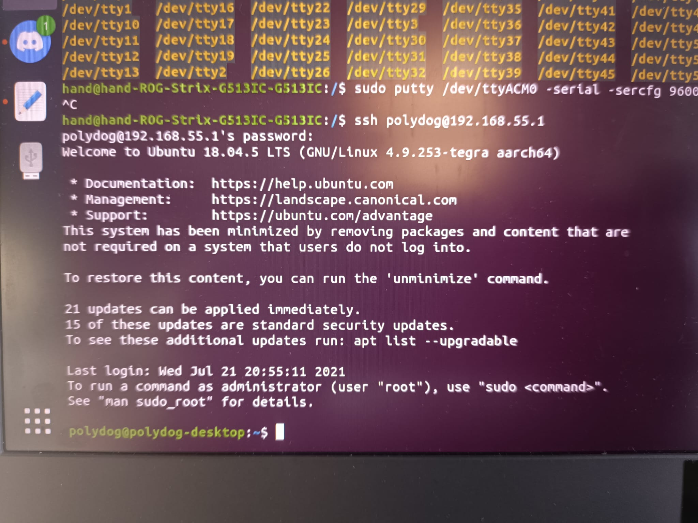
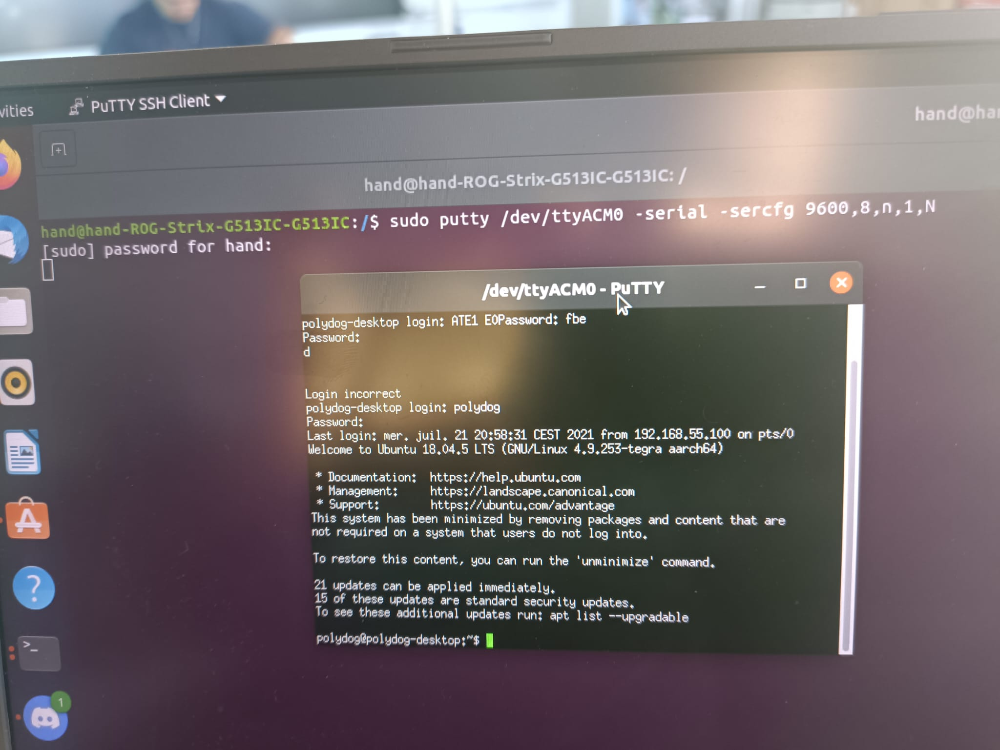
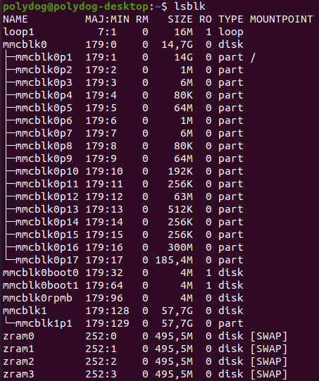
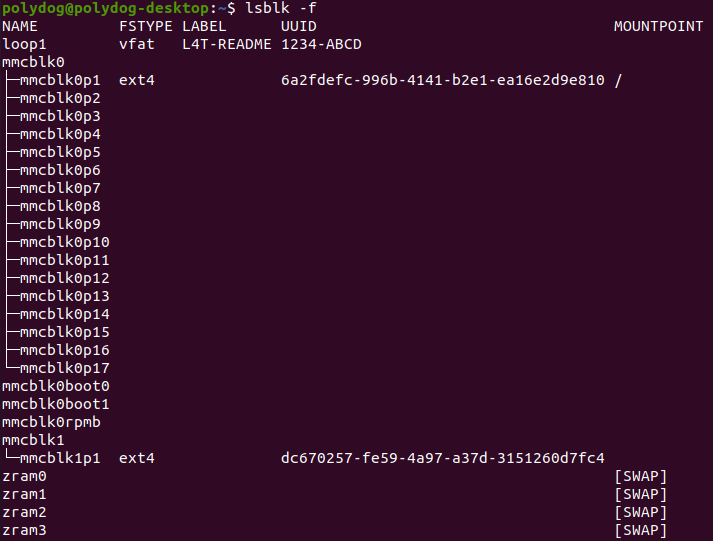
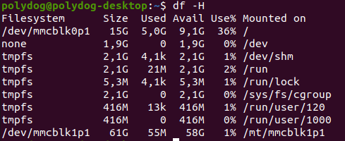

# Getting started with the nvidia card


## Flash Nvidia Card
The NVIDIA Jetson Nano is a powerful single-board computer designed for AI and machine learning applications. In order to flash the Jetson Nano with a new image, you will need to follow these steps : https://auvidea.eu/download/Software 

The firmware to use is the following : https://auvidea.eu/download/firmware/Jetpack_4.6/Jetpack_4_6_TX2NX_JNX30.tar.bz2

```
Before you start : (in the setup guide)
Please make sure to use a Linux host PC with Ubuntu 18.04 LTS or Ubuntu 20.04 LTS (other
versions may work but some caused problems in the past!) operating system. Please use a
native setup (no virtual machine).
```

We did this process with the Mr FAUVEL to help us in this first step. So I don't have the details of the steps in my head. **To be added in the future;**

But, I thought at first that we no longer had the code to connect to the NVIDIA card. So I installed the operating system in dual boot. 

Create a bootable USB key with an ISO image file for Ubuntu ; Boot from USB key; 
Install Ubuntu in dual - boot with Windows 10; Select the operating system at startup.

I used one website very usefull to undestand how to install ubuntu on my machine : https://lecrabeinfo.net/installer-ubuntu-20-04-lts-dual-boot-windows-10.html
We can find a lot in Google, but this one is the one I used.

## SDK Manager

The NVIDIA SDK Manager is a tool that allows developers to easily install, update, and manage the libraries, tools, and samples needed to develop applications using NVIDIA GPUs. It simplifies the process of setting up a development environment and can help ensure that the correct version of the software is installed and configured for the specific GPU in use. Additionally, it can be used to download and install additional libraries and tools for specific use cases, such as deep learning or computer vision.

But when I wanted to use it, it says that I don't have the right distribution. Here the results I get : 

###Image


Looking on Internet, I found that some people try to fake the distribution of ubuntu by editing /etc/lsb-release

DISTRIB_ID=Ubuntu
DISTRIB_RELEASE=20.04
DISTRIB_CODENAME=raring
DISTRIB_DESCRIPTION="Ubuntu 20.04"

As a text file, you can edit this (if you have superuser rights). It might be the file that is used to test what version you are using.

https://askubuntu.com/questions/292866/how-to-fake-ubuntu-version-number-to-applications


I did not succeed, trying both methods. So for the moment, I could not use the software. 

## Connect to Nvidia card 

By SSH : with this command : ssh polydog@192.168.55.1



With putty : I had to find previously the serial port which in my case was /dev/ttyACM0. 




## How to Format Disk Partitions in Linux 

On the Nvidia card, we don't have much space to use it properly and add code and other files. So we need to be able to add an external SD card or a hard disk.

Here is the website, I started to follow :

https://phoenixnap.com/kb/linux-format-disk

### 1] <u>Checking the partitions</u>



Adding the option -f we can see that's the corresponding partition is mmcblk1p1

### <u>2] Making a new file system</u>

sudo mkfs -t ext4 /dev/mmcblk1p1

If we run the command lsblk with -f option (Output info about filesystems) :




It shows that there is a device named mmcblk1 with a single partition called mmcblk1p1 and it has a ext4 file system and UUID dc670257-fe59-4a97-a37d-3151260d7fc4

### <u>3] Mounting the Disk Partition in Linux</u>

Before using the disk, create a mount point and mount the partition to it. A mount point is a directory used to access data stored in disks.

```
sudo mkdir -p /mt/mmcblk1p1
sudo mount -t auto /dev/mmcblk1p1 /mt/mmcblk1p1
```

If we check the disk space, we can see we have 58G available.



## Move home folder to second drive

### <u>1] Copy HOME to the new location</u>


sudo rsync -avx /home/ /mt/mmcblk1p1

rsync works unidirectionally i.e. it synchronizes, copies or refreshes data from a source (local or remote) to a destination (local or remote) by transferring only the bytes of files that have been modified .

with 

-a or --archive : is a quick way to say you want recursion and preserve virtually everything. The only exception is that if --files-from was specified then -r is not used.

-v or --verbose : Indicates that a program or command explicitly displays all operations performed.

-x or --one-file-system does not cross file system boundaries 

Here is the details of all the command line thanks to the -v option : 

```
sudo rsync -avx /home /mt/mmcblk1p1
[sudo] password for polydog: 
Sorry, try again.
[sudo] password for polydog: 
sending incremental file list
home/
home/polydog/
home/polydog/.ICEauthority
home/polydog/.bash_logout
home/polydog/.bashrc
home/polydog/.profile
home/polydog/.sudo_as_admin_successful
home/polydog/.xsessionrc
home/polydog/examples.desktop
home/polydog/.cache/
home/polydog/.cache/motd.legal-displayed
home/polydog/.cache/compizconfig-1/
home/polydog/.cache/compizconfig-1/animation.pb
home/polydog/.cache/compizconfig-1/colorfilter.pb
home/polydog/.cache/compizconfig-1/commands.pb
home/polydog/.cache/compizconfig-1/compiztoolbox.pb
home/polydog/.cache/compizconfig-1/composite.pb
home/polydog/.cache/compizconfig-1/copytex.pb
home/polydog/.cache/compizconfig-1/core.pb
home/polydog/.cache/compizconfig-1/decor.pb
home/polydog/.cache/compizconfig-1/expo.pb
home/polydog/.cache/compizconfig-1/ezoom.pb
home/polydog/.cache/compizconfig-1/fade.pb
home/polydog/.cache/compizconfig-1/gnomecompat.pb
home/polydog/.cache/compizconfig-1/grid.pb
home/polydog/.cache/compizconfig-1/imgpng.pb
home/polydog/.cache/compizconfig-1/matecompat.pb
home/polydog/.cache/compizconfig-1/mousepoll.pb
home/polydog/.cache/compizconfig-1/move.pb
home/polydog/.cache/compizconfig-1/opengl.pb
home/polydog/.cache/compizconfig-1/place.pb
home/polydog/.cache/compizconfig-1/regex.pb
home/polydog/.cache/compizconfig-1/resize.pb
home/polydog/.cache/compizconfig-1/scale.pb
home/polydog/.cache/compizconfig-1/session.pb
home/polydog/.cache/compizconfig-1/snap.pb
home/polydog/.cache/compizconfig-1/staticswitcher.pb
home/polydog/.cache/compizconfig-1/switcher.pb
home/polydog/.cache/compizconfig-1/unitymtgrabhandles.pb
home/polydog/.cache/compizconfig-1/unityshell.pb
home/polydog/.cache/compizconfig-1/vpswitch.pb
home/polydog/.cache/compizconfig-1/wall.pb
home/polydog/.cache/compizconfig-1/workarounds.pb
home/polydog/.cache/evolution/
home/polydog/.cache/evolution/addressbook/
home/polydog/.cache/evolution/addressbook/trash/
home/polydog/.cache/evolution/calendar/
home/polydog/.cache/evolution/calendar/trash/
home/polydog/.cache/evolution/mail/
home/polydog/.cache/evolution/mail/trash/
home/polydog/.cache/evolution/memos/
home/polydog/.cache/evolution/memos/trash/
home/polydog/.cache/evolution/sources/
home/polydog/.cache/evolution/sources/trash/
home/polydog/.cache/evolution/tasks/
home/polydog/.cache/evolution/tasks/trash/
home/polydog/.cache/gnome-software/
home/polydog/.cache/gnome-software/fwupd/
home/polydog/.cache/gnome-software/fwupd/remotes.d/
home/polydog/.cache/gnome-software/fwupd/remotes.d/lvfs/
home/polydog/.cache/gnome-software/odrs/
home/polydog/.cache/gnome-software/shell-extensions/
home/polydog/.cache/gstreamer-1.0/
home/polydog/.cache/gstreamer-1.0/registry.aarch64.bin
home/polydog/.cache/ibus-table/
home/polydog/.cache/ibus/
home/polydog/.cache/ibus/bus/
home/polydog/.cache/ibus/bus/registry
home/polydog/.cache/wallpaper/
home/polydog/.cache/wallpaper/0_5_1920_1080_c917866213933099a137e924c7fbbd67
home/polydog/.config/
home/polydog/.config/gnome-initial-setup-done
home/polydog/.config/user-dirs.dirs
home/polydog/.config/user-dirs.locale
home/polydog/.config/compiz-1/
home/polydog/.config/compiz-1/compizconfig/
home/polydog/.config/compiz-1/compizconfig/config
home/polydog/.config/compiz-1/compizconfig/done_upgrades
home/polydog/.config/dconf/
home/polydog/.config/dconf/user
home/polydog/.config/dconf/user.2KJ260
home/polydog/.config/evolution/
home/polydog/.config/evolution/sources/
home/polydog/.config/evolution/sources/system-proxy.source
home/polydog/.config/gnome-session/
home/polydog/.config/gnome-session/saved-session/
home/polydog/.config/goa-1.0/
home/polydog/.config/gtk-3.0/
home/polydog/.config/gtk-3.0/bookmarks
home/polydog/.config/ibus/
home/polydog/.config/ibus/bus/
home/polydog/.config/ibus/bus/a3d9197b765643568af09eb2bd3e5ce7-unix-1
home/polydog/.config/libaccounts-glib/
home/polydog/.config/libaccounts-glib/accounts.db
home/polydog/.config/nautilus/
home/polydog/.config/nautilus/desktop-metadata
home/polydog/.config/pulse/
home/polydog/.config/pulse/a3d9197b765643568af09eb2bd3e5ce7-card-database.tdb
home/polydog/.config/pulse/a3d9197b765643568af09eb2bd3e5ce7-default-sink
home/polydog/.config/pulse/a3d9197b765643568af09eb2bd3e5ce7-default-source
home/polydog/.config/pulse/a3d9197b765643568af09eb2bd3e5ce7-device-volumes.tdb
home/polydog/.config/pulse/a3d9197b765643568af09eb2bd3e5ce7-stream-volumes.tdb
home/polydog/.config/pulse/cookie
home/polydog/.config/unity/
home/polydog/.config/unity/first_run.stamp
home/polydog/.config/update-notifier/
home/polydog/.gconf/
home/polydog/.gnupg/
home/polydog/.gnupg/private-keys-v1.d/
home/polydog/.local/
home/polydog/.local/share/
home/polydog/.local/share/gsettings-data-convert
home/polydog/.local/share/session_migration-unity
home/polydog/.local/share/applications/
home/polydog/.local/share/applications/nvbackground_unity
home/polydog/.local/share/evolution/
home/polydog/.local/share/evolution/addressbook/
home/polydog/.local/share/evolution/addressbook/system/
home/polydog/.local/share/evolution/addressbook/system/contacts.db
home/polydog/.local/share/evolution/addressbook/system/photos/
home/polydog/.local/share/evolution/addressbook/trash/
home/polydog/.local/share/evolution/calendar/
home/polydog/.local/share/evolution/calendar/system/
home/polydog/.local/share/evolution/calendar/system/calendar.ics
home/polydog/.local/share/evolution/calendar/trash/
home/polydog/.local/share/evolution/mail/
home/polydog/.local/share/evolution/mail/trash/
home/polydog/.local/share/evolution/memos/
home/polydog/.local/share/evolution/memos/trash/
home/polydog/.local/share/evolution/tasks/
home/polydog/.local/share/evolution/tasks/system/
home/polydog/.local/share/evolution/tasks/system/tasks.ics
home/polydog/.local/share/evolution/tasks/trash/
home/polydog/.local/share/gvfs-metadata/
home/polydog/.local/share/gvfs-metadata/home
home/polydog/.local/share/gvfs-metadata/home-45021589.log
home/polydog/.local/share/ibus-table/
home/polydog/.local/share/icc/
home/polydog/.local/share/icc/edid-8aadfaa7b80cd5dc50cee0aff9125f4b.icc
home/polydog/.local/share/keyrings/
home/polydog/.local/share/keyrings/login.keyring
home/polydog/.local/share/keyrings/user.keystore
home/polydog/.local/share/nautilus/
home/polydog/.local/share/nautilus/scripts/
home/polydog/.local/share/sounds/
home/polydog/.local/share/unity-settings-daemon/
home/polydog/.local/share/unity-settings-daemon/input-sources-converted
home/polydog/.local/share/zeitgeist/
home/polydog/.local/share/zeitgeist/activity.sqlite
home/polydog/.local/share/zeitgeist/activity.sqlite-shm
home/polydog/.local/share/zeitgeist/activity.sqlite-wal
home/polydog/.local/share/zeitgeist/fts.index/
home/polydog/.local/share/zeitgeist/fts.index/flintlock
home/polydog/.local/share/zeitgeist/fts.index/iamglass
home/polydog/.local/share/zeitgeist/fts.index/position.glass
home/polydog/.local/share/zeitgeist/fts.index/postlist.glass
home/polydog/.local/share/zeitgeist/fts.index/termlist.glass
home/polydog/.nv/
home/polydog/.nv/GLCache/
home/polydog/.nv/GLCache/f3f32f4c8f62b07c8f90a4d35f5690b2/
home/polydog/.nv/GLCache/f3f32f4c8f62b07c8f90a4d35f5690b2/f310c1b5f5976abd/
home/polydog/.nv/GLCache/f3f32f4c8f62b07c8f90a4d35f5690b2/f310c1b5f5976abd/736353d788902c9e.bin
home/polydog/.nv/GLCache/f3f32f4c8f62b07c8f90a4d35f5690b2/f310c1b5f5976abd/736353d788902c9e.toc
home/polydog/Desktop/
home/polydog/Desktop/chromium-browser.desktop
home/polydog/Desktop/gnome-terminal.desktop
home/polydog/Desktop/lxterminal.desktop
home/polydog/Desktop/nv_devzone.desktop
home/polydog/Desktop/nv_forums.desktop
home/polydog/Desktop/nv_jetson_projects.desktop
home/polydog/Desktop/nv_jetson_zoo.desktop
home/polydog/Desktop/nv_l4t_readme.desktop
home/polydog/Documents/
home/polydog/Downloads/
home/polydog/Music/
home/polydog/Pictures/
home/polydog/Public/
home/polydog/Templates/
home/polydog/Videos/
home/polydog/[mountpoint]/

sent 3,095,096 bytes  received 2,149 bytes  6,194,490.00 bytes/sec
total size is 3,084,464  speedup is 1.00

```

We then may mount and unmount the new partition as HOME with :
```
sudo mount /dev/sdb1 /home
sudo umount /home/*
```
Then:
sudo rm -rf /home/*  # deletes the old home

The mount command mounts a storage device or filesystem, making it accessible and attaching it to an existing directory structure.

The umount command "unmounts" a mounted filesystem, informing the system to complete any pending read or write operations, and safely detaching it.

the running command sudo blkid or lsblk with -f give me the UUID of the new partition:

/dev/mmcblk1p1: UUID="dc670257-fe59-4a97-a37d-3151260d7fc4" TYPE="ext4" PARTUUID="0e6c714a-01"

### <u>2] Make HOME permanent</u>

We have to enter in the fstab file.

The /etc/fstab file is one of the most important files in a Linux-based system, since it stores static information about filesystems, their mountpoints and mount options. 

sudo vim /etc/fstab # Only vim worked.

And we had the following line at the end of the file :
UUID=dc670257-fe59-4a97-a37d-3151260d7fc4   /home    ext4    defaults   0  2


I also tried to use gedit : 

```
sudo gedit /etc/fstab
Unable to init server: Could not connect: Connection refused

(gedit:7556): Gtk-WARNING **: 23:10:11.840: cannot open display: 
```

It sounds like there is an issue with the Jetson Nano's graphics stack, not being properly configured to work with the Gedit text editor, maybe.

I just left it like that because it works with vim editor.

At the end I run sudo reboot.


