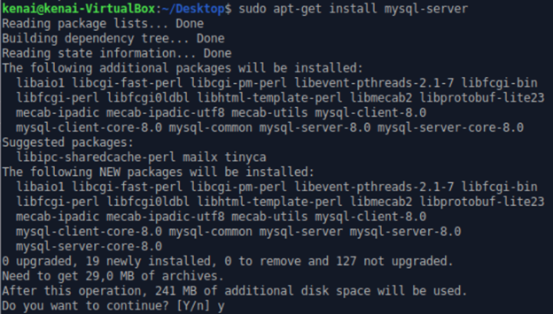
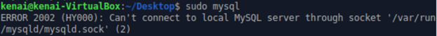
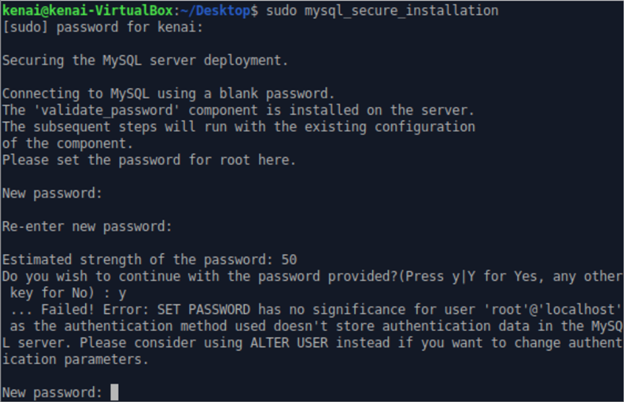
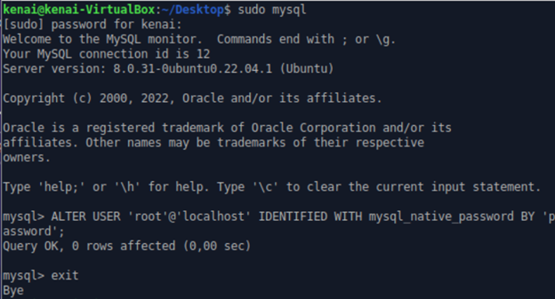
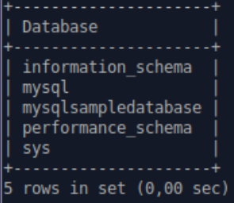

Introduction : 

MySQL is an open-source database management system, commonly installed as part of the popular LAMP (Linux, Apache, MySQL, PHP/Python/Perl) stack. It implements the relational model and uses Structured Query Language (better known as SQL) to manage its data.

Step 1 : install MySQL and download backup file : 

You have to use the command sudo apt-get install mysql-server 



Ensure that the server is running using the systemctl start command: sudo systemctl start mysql.service

If we don't run this command, this error appears :




Step 2 : Configuring MySQL

For fresh installations of MySQL, you’ll want to run the DBMS’s included security script. This script changes some of the less secure default options for things like remote root logins and sample users. For more details : go on this website : https://www.digitalocean.com/community/tutorials/how-to-install-mysql-on-ubuntu-20-04


To avoid entering this recursive loop, though, you’ll need to first adjust how your root MySQL user authenticates :




First, we open up the MySQL prompt, by running : sudo mysql

Then run the following ALTER USER command to change the root user’s authentication method to one that uses a password. The following example changes the authentication method to mysql_native_password:

ALTER USER 'root'@'localhost' IDENTIFIED WITH mysql_native_password BY 'password';



We run the security script with : sudo mysql_secure_installation :

mysql_secure_installation is a shell script available on Unix systems, and enables you to improve the security of your installation in the following ways:

-You can set a password for root accounts.
-You can remove root accounts that are accessible from outside the local host.
-You can remove anonymous-user accounts.
-You can remove the test database, which by default can be accessed by anonymous users.

```bash
kenai@kenai-VirtualBox:~/Desktop$ sudo mysql_secure_installation

Securing the MySQL server deployment.

Enter password for user root: 
The 'validate_password' component is installed on the server.
The subsequent steps will run with the existing configuration
of the component.
Using existing password for root.

Estimated strength of the password: 50 
Change the password for root ? ((Press y|Y for Yes, any other key for No) : no

 ... skipping.
By default, a MySQL installation has an anonymous user,
allowing anyone to log into MySQL without having to have
a user account created for them. This is intended only for
testing, and to make the installation go a bit smoother.
You should remove them before moving into a production
environment.

Remove anonymous users? (Press y|Y for Yes, any other key for No) : y
Success.


Normally, root should only be allowed to connect from
'localhost'. This ensures that someone cannot guess at
the root password from the network.

Disallow root login remotely? (Press y|Y for Yes, any other key for No) : y
Success.

By default, MySQL comes with a database named 'test' that
anyone can access. This is also intended only for testing,
and should be removed before moving into a production
environment.


Remove test database and access to it? (Press y|Y for Yes, any other key for No) : y
 - Dropping test database...
Success.

 - Removing privileges on test database...
Success.

Reloading the privilege tables will ensure that all changes
made so far will take effect immediately.

Reload privilege tables now? (Press y|Y for Yes, any other key for No) : y
Success.

All done! 

```

Step 3 — Creating a Dedicated MySQL User and Granting Privileges

Upon installation, MySQL creates a root user account which you can use to manage your database. This user has full privileges over the MySQL server, meaning it has complete control over every database, table, user, and so on. Because of this, it’s best to avoid using this account outside of administrative functions. This step outlines how to use the root MySQL user to create a new user account and grant it privileges.

The following command create a user that authenticates with caching_sha2_password ([The MySQL documentation](https://dev.mysql.com/doc/refman/8.0/en/upgrading-from-previous-series.html#upgrade-caching-sha2-password) recommends this plugin). Be sure to change sammy to your preferred username and password to a strong password of your choosing

CREATE USER 'username'@'host' IDENTIFIED WITH authentication_plugin BY 'password';


```
mysql> CREATE USER 'kenai'@'localhost' IDENTIFIED BY '***************';
Query OK, 0 rows affected (0,02 sec)
```

After creating your new user, you can grant them the appropriate privileges. The general syntax for granting user privileges is as follows:

GRANT PRIVILEGE ON database.table TO 'username'@'host';

The PRIVILEGE value in this example syntax defines what actions the user is allowed to perform on the specified database and table. You can grant multiple privileges to the same user in one command by separating each with a comma. You can also grant a user privileges globally by entering asterisks (*) in place of the database and table names.

I run this command : mysql> GRANT CREATE, ALTER, DROP, INSERT, UPDATE, DELETE, SELECT, REFERENCES, RELOAD on \*.* TO 'kenai'@'localhost' WITH GRANT OPTION;

This statement also includes WITH GRANT OPTION. This will allow your MySQL user to grant any permissions that it has to other users on the system.

Following this, it’s good practice to run the FLUSH PRIVILEGES command. This will free up any memory that the server cached as a result of the preceding CREATE USER and GRANT statements:

mysql>FLUSH PRIVILEGES;
mysql>exit

Now we can log in as my new MySQL user : mysql -u kenai -p

However, I realized that I needed to be able to connect to my sql without a password, and thus have access to classicmodels to create backups, so I type this command (being root in mysql to grant privilege to user kenai) : ALTER USER kenai@localhost IDENTIFIED WITH auth_socket;

To be able to modify the database as the user kenai, we must type this command : GRANT PROCESS On *.* TO kenai@localhost;


Error : 

Job for mysql.service failed because the control process exited with error code.
See "systemctl status mysql.service" and "journalctl -xeu mysql.service" for details.


Step4 : 

Recuperer le fichier zip qui s'ajoute dans le répertoire courant à l'execution de cette commande : wget https://www.mysqltutorial.org/wp-content/uploads/2018/03/mysqlsampledatabase.zip

```
kenai@kenai-VirtualBox:~/Desktop$ unzip mysqlsampledatabase.zip
Archive:  mysqlsampledatabase.zip
  inflating: mysqlsampledatabase.sql
```

Step5 :

Create a database : ``` mysql > create database mysqlsampledatabase; ```

In the following image we can see the database has been created succesfully (commande line : show databases;) :




Now, we can restore the MySQL database from the dump file. The syntax for the command is as follows:

``` mysql -u [user name] –p [target_database_name] < [mysqlsampledatabase.sql] ```
The parameters include:

-u [user name]is a username to connect to a MySQL server.
-p is a password for the username you use to connect to the server.
target_database_name is the name of the empty database into which you want to load data from the backup file.
< is a parameter that refers to the process of a database restore.
[mysqlsampledatabase.sql] is the path to the dump file.

But then, I realise that in the file .sql there is : 

```
CREATE DATABASE /*!32312 IF NOT EXISTS*/`classicmodels` /*!40100 DEFAULT CHARACTER SET latin1 */;

USE `classicmodels`;

```

This is why the backup file restore in the database classicmodels and not in the one i just created. I used DROP DATABASE mysqlsampledatabase; to delete it.


Lien utilisé : 

Usefull link for setup the sql database : https://www.digitalocean.com/community/tutorials/how-to-install-mysql-on-ubuntu-20-04

use of the command mysql_secure_installation : https://mariadb.com/kb/en/mysql_secure_installation/

Plugins : https://dev.mysql.com/doc/refman/8.0/en/upgrading-from-previous-series.html#upgrade-caching-sha2-password