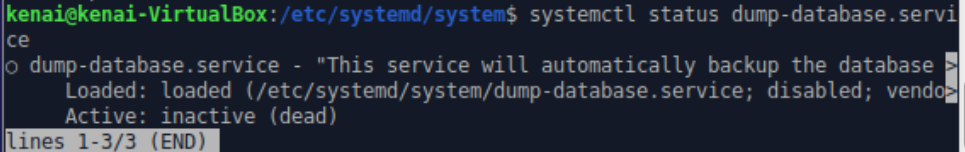
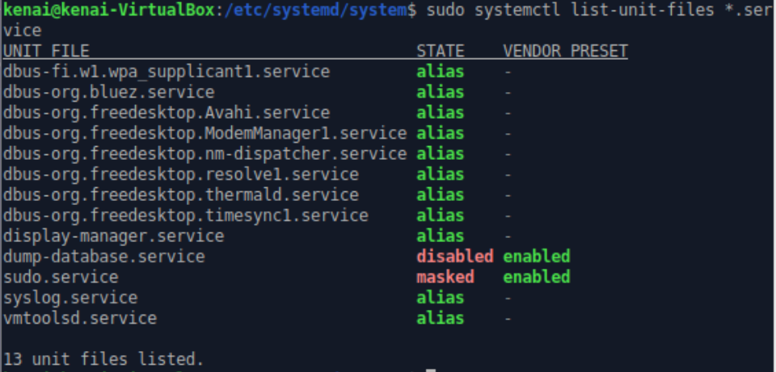
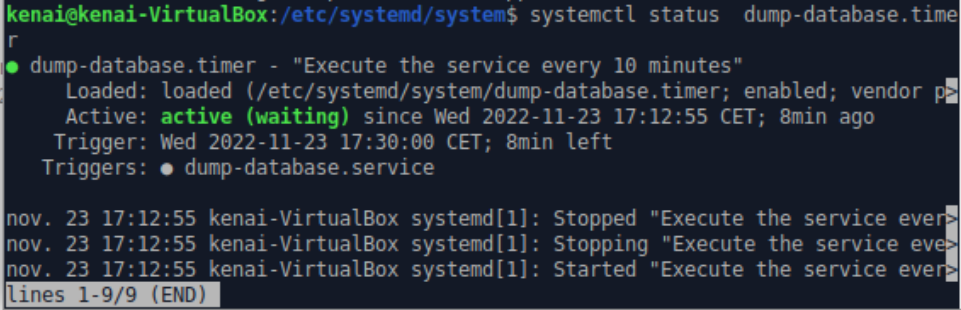

## Setup dump database service

I started by creating a file dump-database.service in the etc/systemd/system directory and included the following : 

```bash
[Unit]
Description="This service will automatically backup the database every 10 minutes and keep the 5 most recent updates of the database"

[Service]
Type=simple
User=kenai
WorkingDirectory=/home/kenai/Desktop
ExecStart=/home/kenai/Desktop/database_backup.sh

[Install]
WantedBy=multi-user.target

```
User= is very important because I setup the privilege for the user kenai and it's not possible for root, I had this error : mysqldump: Got error: 1698: Access denied for user with a service


This command will give the owner (me) read and write permissions and read permissions on the group. Others will have no permissions at all : 

sudo chmod 640 dump-database.service


After modifying a new unit file or modify an existing one, I reloaded the unit file definitions :
sudo systemctl daemon-reload

systemctl status dump-database.service : 



No errors are highlighted, which means that our unit file is syntactically correct.

Here we can see the list of service in my VM :


I wanted the service to be started at startup, so I run :

sudo systemctl enable dump-database

## Setup dump database timer

```
[Unit]
Description="Execute the service every 10 minutes"

[Timer]
OnCalendar=*:0/10
AccuracySec=1s
Unit=backup.Service

[Install]
WantedBy=timers.target
```

After the creation of this file, we run like always the following commands : 
sudo systemctl daemon-reload
sudo systemctl restart dump-database.timer

we can see the status of the timer, there is 8 min left for the next backup of classicmodels database : 



