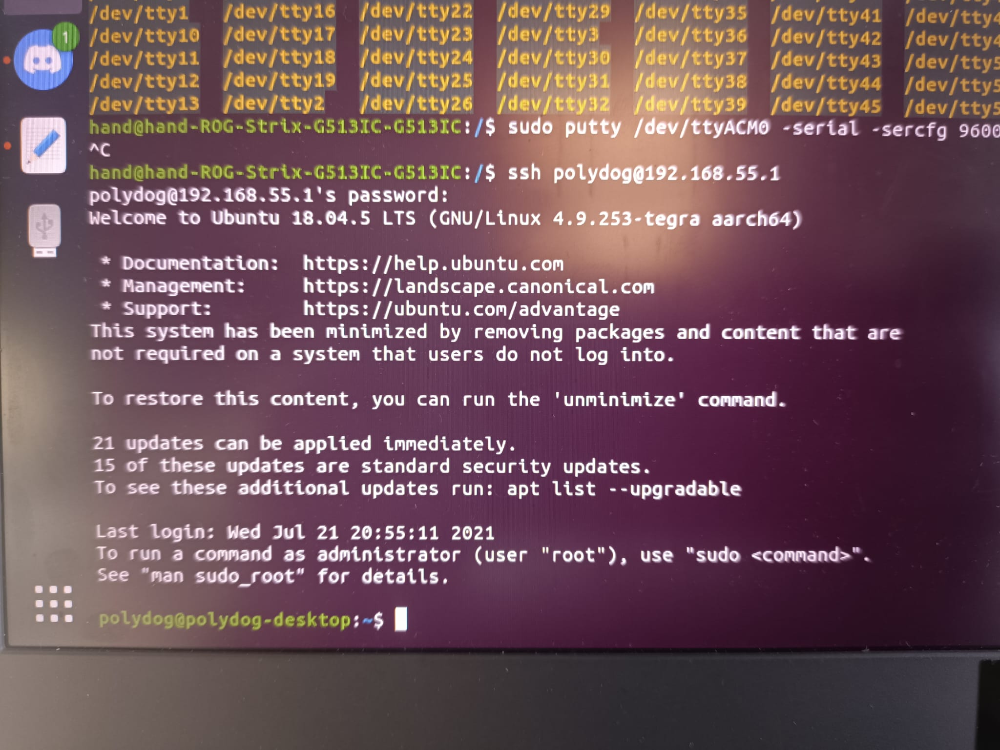
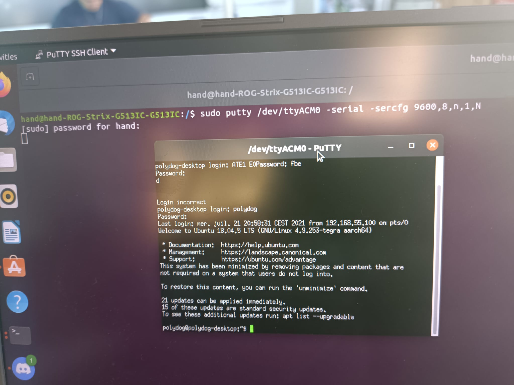

# Getting started with the nvidia card


## Flash Nvidia Card
The NVIDIA Jetson Nano is a powerful single-board computer designed for AI and machine learning applications. In order to flash the Jetson Nano with a new image, you will need to follow these steps : https://auvidea.eu/download/Software 

The firmware to use is the following : https://auvidea.eu/download/firmware/Jetpack_4.6/Jetpack_4_6_TX2NX_JNX30.tar.bz2

```
Before you start : (in the setup guide)
Please make sure to use a Linux host PC with Ubuntu 18.04 LTS or Ubuntu 20.04 LTS (other
versions may work but some caused problems in the past!) operating system. Please use a
native setup (no virtual machine).
```

We did this process with the Mr FAUVEL to help us in this first step. So I don't have the details of the steps in my head. **To be added in the future;**

But, I thought at first that we no longer had the code to connect to the NVIDIA card. So I installed the operating system in dual boot. 

Create a bootable USB key with an ISO image file for Ubuntu ; Boot from USB key; 
Install Ubuntu in dual - boot with Windows 10; Select the operating system at startup.

I used one website very usefull to undestand how to install ubuntu on my machine : https://lecrabeinfo.net/installer-ubuntu-20-04-lts-dual-boot-windows-10.html
We can find a lot in Google, but this one is the one I used.

## SDK Manager

The NVIDIA SDK Manager is a tool that allows developers to easily install, update, and manage the libraries, tools, and samples needed to develop applications using NVIDIA GPUs. It simplifies the process of setting up a development environment and can help ensure that the correct version of the software is installed and configured for the specific GPU in use. Additionally, it can be used to download and install additional libraries and tools for specific use cases, such as deep learning or computer vision.

But when I wanted to use it, it says that I don't have the right distribution. Here the results I get : 

###Image


Looking on Internet, I found that some people try to fake the distribution of ubuntu by editing /etc/lsb-release

DISTRIB_ID=Ubuntu
DISTRIB_RELEASE=20.04
DISTRIB_CODENAME=raring
DISTRIB_DESCRIPTION="Ubuntu 20.04"

As a text file, you can edit this (if you have superuser rights). It might be the file that is used to test what version you are using.

https://askubuntu.com/questions/292866/how-to-fake-ubuntu-version-number-to-applications


I did not succeed, trying both methods. So for the moment, I could not use the software. 

## Connect to Nvidia card 

By SSH : with this command : ssh polydog@192.168.55.1



With putty : I had to find previously the serial port which in my case was /dev/ttyACM0. 




## How to Format Disk Partitions in Linux 

On the Nvidia card, we don't have much space to use it properly and add code and other files. So we need to be able to add an external SD card or a hard disk.

Here is the website, I started to follow :

https://phoenixnap.com/kb/linux-format-disk
