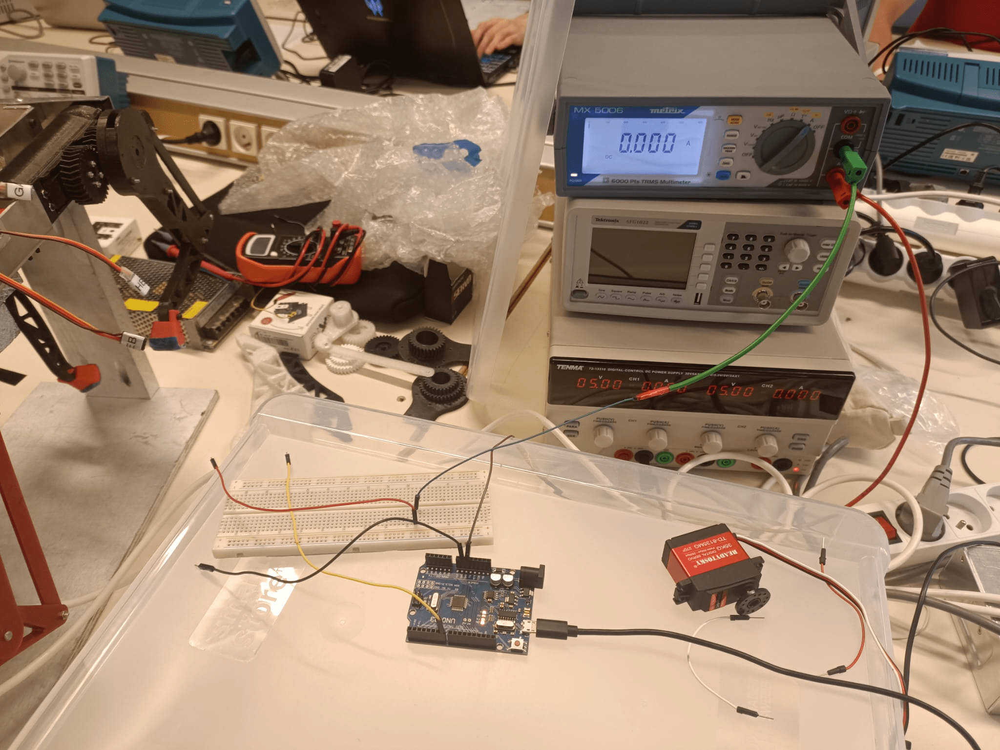
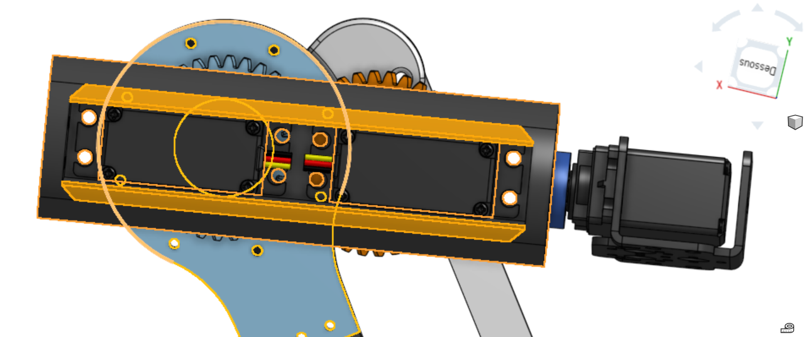

# Session 14/10/2022

##### Polydog_v3 -- October 2022
###### New series of session reports
-----

#### Introduction

Change of pairing. Raphael has gone on a computer training course. New teammate Younes BAZI to improve this robot and make it work for good.

Before starting to work on the dog robot again in early September. We made a bibliographic report to redefine the specifications in writing (contrary to the previous times). We thought about the solutions to make it walk with a little more agility :) and about the different components we will potentially integrate (stabilization sensor, depth camera, ..), replace (lighter and stronger structure, more gripping foot, ..). 

*Link to the pdf :*

[PolyDog_Bibliography_v3.pdf](../../../PolyDog_Bibliography_v3.pdf)

#### Functional test of the servo motors

One lunchtime at the fablab, while running the dog robot with the old code already uploaded on the Arduino board. I realized that the servo motor Knee leg B was not turning. I took a portable digital multimeter and connected it in series between the output of a pin on the ssc32 servo controller board and the GB servo wires. It showed me 4.8A even though the motor was not running. 

Afterwards, during the arduino session, I unplugged all the servos to test them one by one, to make sure that all were working properly.

When plugging in the multimeter I had some trouble getting a consistent amperage value with a new (test) servo motor. It turned out, when comparing the value coming out of the dc power supply tenma with the fixed multimeter on the tables and the portable one, that the latter gave a wrong value. Peter showed me how to connect the cables (as shown on the figure 1.1)

<figure align="center">
  
  <figcaption>Figure 1.1 : Servo amperage test mounting</figcaption>
</figure>

Here is the summary table of the measures :

| Servo Motor TD8135MG | Servo-test 270° | ServoGD | ServoHD | ServoED  | ServoGC  | ServoHC |ServoEC| ServoHA|ServoGA|ServoEA|ServoHB|ServoGB|ServoEB|
| :---: | :---: | :---: | :---: | :---: | :---: | :---: | :---: | :---: | :---: |  :---: |:---: | :---: |  :---: |
|Amperage| 130 mA | 319mA  | 239mA| 206mA| 230mA | 229mA |320mA| 228mA|296mA|350mA|306mA et 6V|338mA| 319mA|

Particularity of servo HB : it works only if it is powered with 6v (from 5.3 in reality), maybe it forces more than the others for an unknown reason.

*Link to the video illustrating it :* https://www.youtube.com/shorts/3E0WOB0feqM

This led me to think that when you can get the dog to walk a few meters again, try to use a power supply that delivers 6 V output. Compare the robot's approach.

#### Housings and screws

Observation n°1 : The screws of the legs of the robot dog are constantly unscrewed because the nuts are not fully tightened (it is a zone of articulation which causes friction if the parts are too well fixed). You have to screw everything back on properly and add a second nut for the next session.

Observation n°2 : The servo motors are not well enough fixed in their casing, it turns and modifies the movement of the motor axis. 

Moreover, at the level of the joins between the faces, there are places of cracks and certain parts broke with time. 

To remedy these problems: I took back the cases that I had modelled on Onshape. I removed the rounding effect inside the case to stick to the servo motors (as you can see the orange part on figure 1.2).

<figure align="center">
  
  <figcaption>Figure2.2-Housing modification for servo stabilization</figcaption>
</figure>

The printers were not available in the morning to test a box. I hope that for the weekend, the printing could be launched and that I can get it on Monday before the next session which takes place on Tuesday, October 18.

