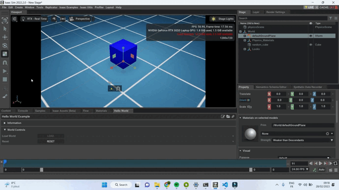
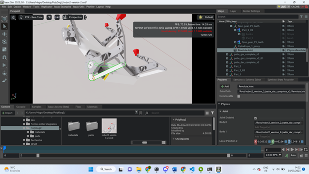

# Session 12 - Week 9

##### Polydog_v3 -- February 2023

-----

## Installation of the Isaac Sim software

First of all, I started to install the Nvidia Omniverse Application, by following this tutorial :  https://docs.omniverse.nvidia.com/app_isaacsim/app_isaacsim/tutorial_intro_simple_objects.html


At first I was stuck installing Isaac Sim on the Omniverse app. It would load indefinitely at one stage, and looking at my computer's configurations I didn't have the Nvidia graphics card enabled and my computer was running on the AMD graphics card in the processor.

I had to install the necessary drivers, it took me a little while to figure out how to do it.
Once this was done, the installation was done without a hitch.

## Add the files of the robot

I first tried to import the stl files directly into Isaac Sim, but I could only import the robot in parts, one leg at a time and the joints were not reported in the software :

https://www.youtube.com/watch?v=pxPFr58gHmQ&ab_channel=NVIDIAOmniverse


I then focused on understanding the basics by creating a floor, a cube, and by modifying a python code, modified the behaviour of the simulation.

Here's the code of My awesome example :


```py
from omni.isaac.examples.base_sample import BaseSample
from omni.isaac.core import World
import numpy as np

# Can be used to create a new cube or to point to an already existing cube in stage.
from omni.isaac.core.objects import DynamicCuboid

# Note: checkout the required tutorials at https://docs.omniverse.nvidia.com/app_isaacsim/app_isaacsim/overview.html


class HelloWorld(BaseSample):
    def __init__(self) -> None:
        super().__init__()
        return

    def setup_scene(self):
        world = World.instance()
        world = self.get_world()
        world.scene.add_default_ground_plane()
        fancy_cube = world.scene.add(
            DynamicCuboid(
                prim_path="/World/random_cube", # The prim path of the cube in the USD stage
                name="fancy_cube", # The unique name used to retrieve the object from the scene later on
                position=np.array([0, 0, 1.0]), # Using the current stage units which is in meters by default.
                scale=np.array([0.5015, 0.5015, 0.5015]), # most arguments accept mainly numpy arrays.
                color=np.array([0, 0, 1.0]), # RGB channels, going from 0-1
            ))
        return

 # Here we assign the class's variables
    # this function is called after load button is pressed
    # regardless starting from an empty stage or not
    # this is called after setup_scene and after
    # one physics time step to propagate appropriate
    # physics handles which are needed to retrieve
    # many physical properties of the different objects
    async def setup_post_load(self):
        self._world = self.get_world()
        self._cube = self._world.scene.get_object("fancy_cube")
        self._world.add_physics_callback("sim_step", callback_fn=self.print_cube_info) #callback names have to be unique
        return 

    # here we define the physics callback to be called before each physics step, all physics callbacks must take
    # step_size as an argument
    def print_cube_info(self, step_size):    
        position, orientation = self._cube.get_world_pose()
        linear_velocity = self._cube.get_linear_velocity()
        # will be shown on terminal
        print("Cube position is : " + str(position))
        print("Cube's orientation is : " + str(orientation))
        print("Cube's linear velocity is : " + str(linear_velocity))
```

The code build a cube in the 3d space and when it falls, I recorded every position, orientation and velocity during the movement and I had printed on the cmd panel.



Then, I tried loading the Onshape assembly again by removing the electronic boards which add a lot of weight to the number of robot parts. 

This worked well.

For the moment, on the software, I have the model of the robot, but the joints that I added (cylindrical, fixed and gears, do not really give the movements that I would expect. When I press the play button we can see on the image below, the parts of the leg are constrained or make unwanted rotations :





