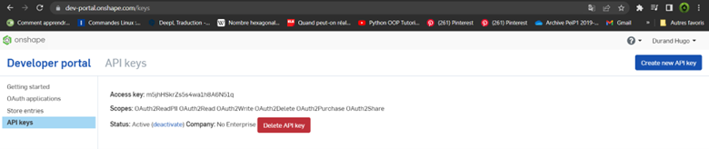
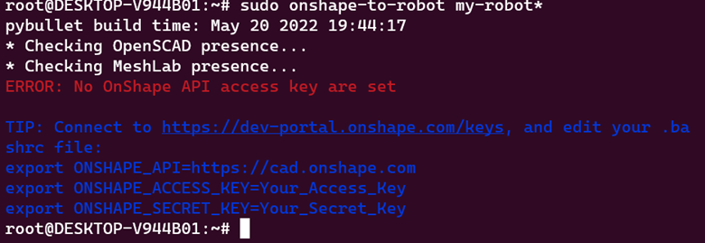
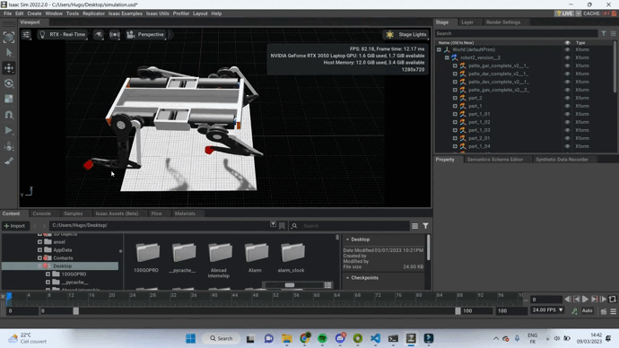

# Session 13  - Week 10

##### Polydog_v3 -- March 2023

-----

## Importing Onshape file with joint

I followed the following tutorial in order to be able to transform a Onshape assembly into a URDF format, wich I can import in Isaac Sim or in another simulation software. This allow me to add the robot assembly with all the joint I made on Onshape.

https://onshape-to-robot.readthedocs.io/en/latest/installation.html

https://www.youtube.com/watch?v=0M2b1p6H20o&ab_channel=Makeitnow

https://www.youtube.com/watch?v=C8oK4uUmbRw&ab_channel=Gr%C3%A9goirePassault

I create an API key of Onshape, in this website https://dev-portal.onshape.com/keys.

Then I added something like this in your .bashrc:

// Obtained at https://dev-portal.onshape.com/keys
export ONSHAPE_API=https://cad.onshape.com
export ONSHAPE_ACCESS_KEY=Your_Access_Key
export ONSHAPE_SECRET_KEY=Your_Secret_Key

Then I created a my-robot/config.json file with the following inside :

{
    "documentId": "document-id",
    "outputFormat": "urdf"
}

The document-id is the number (below XXXXXXXXX) you can find in Onshape URL:

https://cad.onshape.com/documents/XXXXXXXXX/w/YYYYYYYY/e/ZZZZZZZZ

onshape-to-robot my-robot :

It tells me that I didn't set the keys in the .bashrc. I also tried to alternatively, store those keys in the config.json file, that will override those parameters. ---> Then it worked.

I have all the file usd of my document onshape. I will try to open robot2_version__2.usd in Isaac Sim.

Unfortunately the links are not imported into the software, so it is the same. Here is an example of the simulation :

The result should have produced a collapse of the lower parts of the legs, but they were detached from the body proving in my opinion, the non presence of connections.

