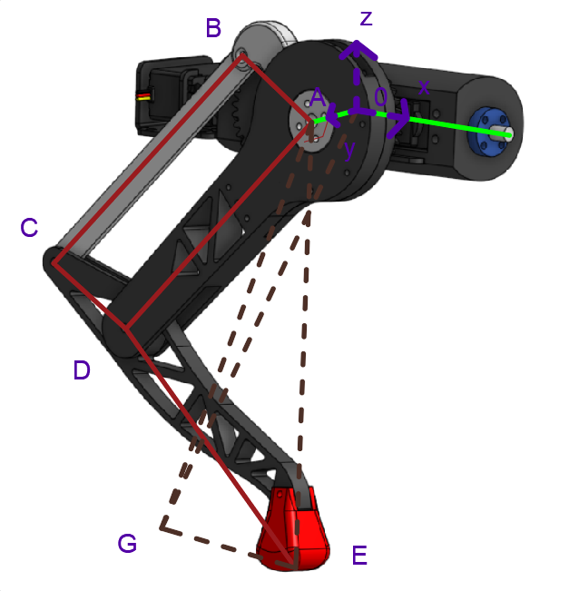
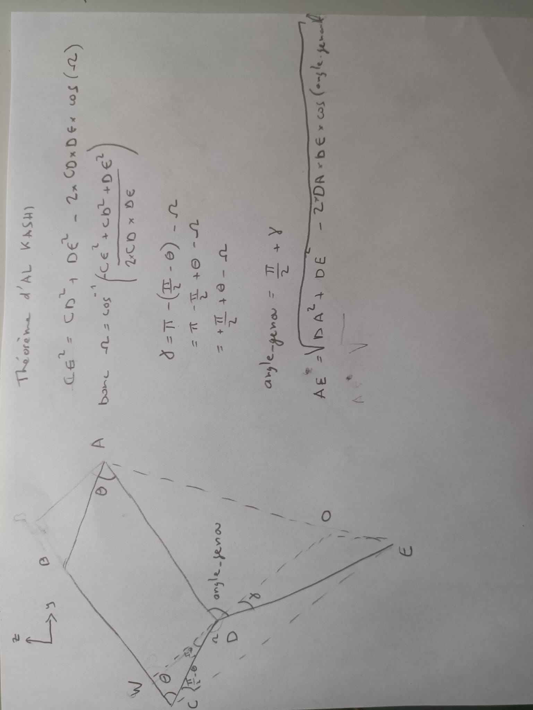

# Session 14 - Week 12

##### Polydog_v3 -- March 2023

---

## Better Algorithms for walking

I've changeed some angles, and minimize the lifting of the leg. It work better but it's not enough to have a clean walk as we can except.

```c++
void PolyDog::avance2()
{
    int time = 200;
    leg_list[1].move_hip(130);
    leg_list[1].move_knee(40);
    leg_list[3].move_hip(130);
    leg_list[3].move_knee(40);
    delay(time);
    leg_list[0].move_knee(80);
    leg_list[2].move_knee(80);
    delay(time);
    leg_list[0].move_hip(120);
    leg_list[0].move_knee(57);
    leg_list[2].move_hip(120);
    leg_list[2].move_knee(57);
    delay(time);
    leg_list[1].move_knee(80);
    leg_list[3].move_knee(80);
    delay(time);
    leg_list[0].move_hip(130);
    leg_list[0].move_knee(40);
    leg_list[2].move_hip(130);
    leg_list[2].move_knee(40);
    delay(time);
    leg_list[1].move_hip(120);
    leg_list[1].move_knee(57);
    leg_list[3].move_hip(120);
    leg_list[3].move_knee(57);
    delay(time);
}
```

Here I show a video of the robot walking with this function implemented:


We can notice that on this video he drags a little the paw and that he tends to fall slightly on the paw which rises, what causes that the paw does not rise and slides on the ground. I think that here I have reached the maximum optimization. I asked Masson to buy squash balls for the feet to hopefully get a better grip on the ground.

## Maths

I drew the orthonormal reference frame on my paw. My goal is to find the coordinates of point E knowing the position of point A and after adding the point 0 into equation which is the point on the rotation axis of the shoulders, I could know the coordinates of E with the angles of my servo-motors, by inverting the equations I can determine the angle of the servo-motors for a chosen coordinates of E.



For the moment I started by calculating the height that the robot takes as a function of the angle teta by taking the fixed DA angle. This will give you an idea of how to do it.



I'll have to look at Mrs. Stolfi's old math classes, to create motion matrices that I should implement in the code.

I also tried to install ros by following a tuto :

https://www.youtube.com/watch?v=O_2swSMecB4&t=7s&ab_channel=robotmania

He begin to developp the process for the installation at 9:20 of the video. But unfortunatly I installed the version 22 of ubuntu instead of 20 and during the installation it gave me an error.

The ROS repository for the Jammy release is not available, which is causing the package manager to fail to locate the ROS packages.

But it requires me to perform a clean installation of that version. This involves downloading an installation image for the desired version of Ubuntu, creating a bootable USB drive or DVD from the image, and then booting your computer from the USB or DVD and following the installation wizard to install the new version of Ubuntu. So I might need to do that next time.
