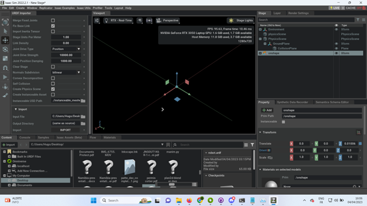

##### Polydog_v3 -- April 2023

---

## Wich software simulation using

The choice of software for simulating a robot largely depends on your specific needs and requirements:

PyBullet: PyBullet is a physics engine that provides a platform for simulating robotics and other physical systems. It supports a wide range of simulation tasks, including collision detection, rigid body dynamics, and soft body dynamics. PyBullet is easy to use and is well-documented, making it a good choice for beginners.

Isaac Sim: Isaac Sim is a high-fidelity simulator that is built on NVIDIA's Omniverse platform. It provides accurate physics simulations and realistic rendering of environments, which can be helpful for tasks such as perception and control. Isaac Sim also offers a range of pre-built robots and environments that can be used to quickly prototype and test robot designs.

ROS2: ROS2 (Robot Operating System 2) is a framework for building robot software. It provides a range of tools and libraries for managing robot hardware, controlling sensors and actuators, and integrating with other systems. ROS2 also includes support for simulation, with several simulation environments available, including Gazebo and Ignition.

Webots: Webots is a commercial robot simulation software that provides a range of features for simulating robotics and other physical systems. It supports a wide range of robot models, sensors, and actuators, and provides a user-friendly interface for designing and testing robot behaviors.

Each of these software options has its own strengths and weaknesses, so you should choose the one that best suits your specific needs and requirements. If you are new to robotics and simulation, PyBullet might be a good place to start due to its ease of use and extensive documentation. If you need a high-fidelity simulator for perception or control tasks, Isaac Sim might be a better choice. If you are already familiar with ROS and need a simulation environment that integrates well with ROS, ROS2 is a good option. If you need a commercial-grade software with advanced features, Webots may be a better choice.

## ROS installation

I started installing ROS on Ubuntu 20.04 distribution but it doesn't work, there is some error, I don't understand how to fix them.

http://wiki.ros.org/noetic/Installation/Ubuntu following this tutorial, I run the following commands in the website page and also check if there is some issues in the software and update of ubuntu, but everything was fine.

https://www.youtube.com/watch?v=Qk4vLFhvfbI&ab_channel=RoboticsBack-End

I also try to remove the dependencies and install them again. But it doesn't worked.

Then I learned that ROS2 run on a specific operating system, so I will try again with a different ubuntu following this two tutorial :

https://www.youtube.com/watch?v=2lIV3dRvHmQ&ab_channel=ArticulatedRobotics
https://www.youtube.com/watch?v=uWzOk0nkTcI&ab_channel=ArticulatedRobotics

## Isaac Sim simulation

I found this video, explaining how to import an urdf on Isaac Sim.
https://www.youtube.com/watch?v=KDG4d97DdI4&ab_channel=Skyentific

So I watch again how to create a urdf file using the Onshape API, following this two amazing tutorial :
https://www.youtube.com/watch?v=C8oK4uUmbRw&t=688s&ab_channel=Gr%C3%A9goirePassault
https://www.youtube.com/watch?v=0M2b1p6H20o&t=1227s&ab_channel=Makeitnow

In this gif, we can see, that the parts are downloaded. There is no issue at the end.

But when I open it on the software, it doesn't show anything :

I don't understand why. I also tried to just import a single element,a poll, but it doesn't work either. It worked for a usd file, without any problem
