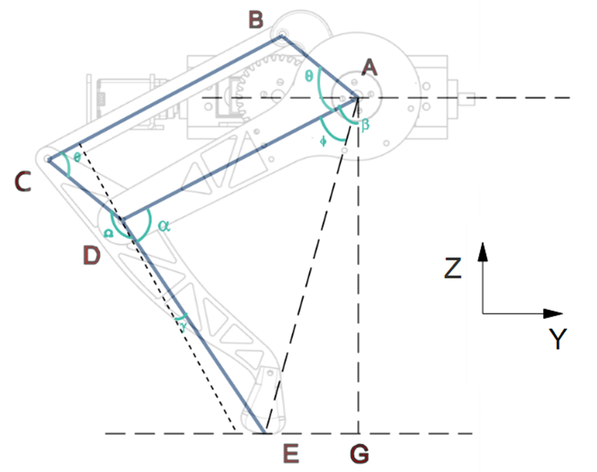
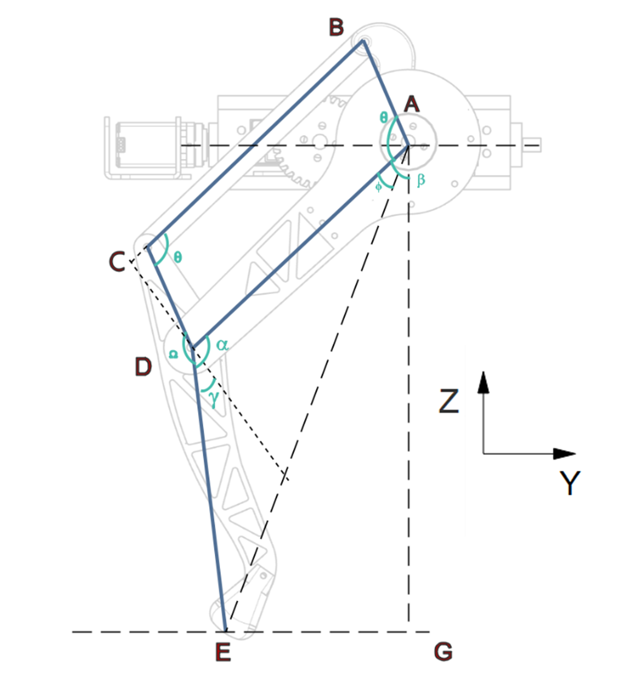
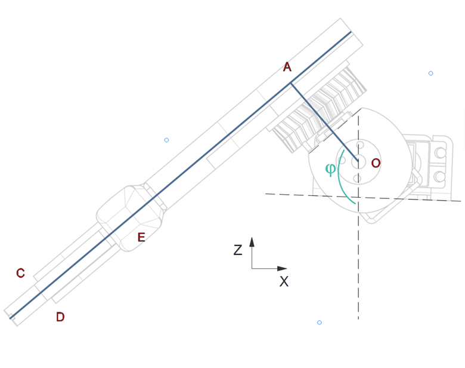
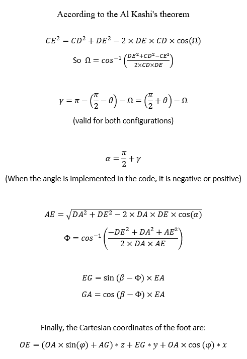

##### Polydog_v3 -- April 2023

---

## Mathematics of the robot

I continued with the robot leg math. I modeled on EdrawMax the diagrams that allowed me to visualize the angles to be calculated.

I forced myself to redo the diagrams on a clean software because previously when I had done them by hand I had badly reproduced an angle, which gave me different results for the calculation of the gamma angle depending on the two starting configurations.I also find it much cleaner for a very certain re-reading by my next future self.

<figure align="center"><figcaption>Figure16.1 : Vizualisation 1 - reference 0yz -angle calculation diagram</figcaption></figure>

<figure align="center"><figcaption>Figure16.2 : Vizualisation 2 - reference 0yz -angle calculation diagram</figcaption></figure>

<figure align="center"><figcaption>Figure16.3 : Vizualisation - reference 0xz -angle calculation diagram</figcaption></figure>

At the end here are the equations that allow me to find the coordinates of the leg (the point E) with respect to the point O :

