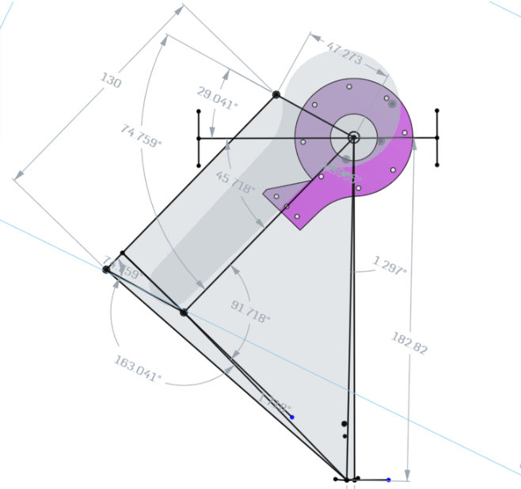

##### Polydog_v3 -- April 2023

---

## Mathematics algorithms

I wrote for example this function, it let me the possibility to test a configuration of the leg. I put in input the height and horizontal distance from the center of the hip of the leg. Then it gives me the two angles I should write in my code in order to obtain the desired configuration.

```c++
def get_angle_simplified(AG, EG):
    EA = math.sqrt(pow(AG, 2) + pow(EG, 2))
    print("EA=" + str(EA))
    epsilon = math.acos(AG / EA) * math.degrees(1)
    print("epsilon=" + str(epsilon))
    little_phi = math.acos(
        (-pow(DE, 2) + pow(DA, 2) + pow(EA, 2)) / (2 * DA * EA)) * math.degrees(1)
    print("littlephi=" + str(little_phi))
    ha = (90 - little_phi - epsilon)
    print("ha=" + str(ha))
    alpha = math.acos((pow(DE, 2) + pow(DA, 2) - pow(EA, 2)
                       ) / (2 * DA * EA)) * math.degrees(1)
    print("alpha=" + str(alpha))
    if (EA >= 180.156):
        ka = (omega + alpha - 180 - ha)
    else:
        ka = (omega - alpha - ha)

    angles = [ha, ka]
    return angles
```

Here I can show the result of this function :

omega=163.1787525637424

EA=182.86682433946294

epsilon=1.2966276126769

littlephi=42.968715453129875

ha=45.734656934193225

alpha=91.19333478003732

[45.734656934193225, 28.63743040958647]

This shows me that the angles calculated by the function give me the right angles to a few decimal places. The small error comes from the fact that the leg is not completely vertical. But I started with this configuration and I didn't want to do again all the setup of I did not want to redo all the work of tracing the lines and angles.



print(get_coordonate_E_simplified(45.734656934193225, 28.63743040958647))
-->(181.974229501661, 3.2701842427722743)

print(get_angle_simplified(181.974229501661, 3.2701842427722743))
-->[45.73465693419328, 28.261679071541295]

## Installing ROS on the Jetson Nano

Here is the script made by Nino MULAC. It add all the command needed for the installation provided by ROS documentation (http://wiki.ros.org/melodic/Installation/Ubuntu). Much more simple :

```bash
#!/bin/bash

# See http://wiki.ros.org/melodic/Installation/Ubuntu for details
set -e;
sudo apt update;
sudo apt install curl;
sudo sh -c 'echo "deb http://packages.ros.org/ros/ubuntu $(lsb_release -sc) main" > /etc/apt/sources.list.d/ros-latest.list';


curl -s https://raw.githubusercontent.com/ros/rosdistro/master/ros.asc | sudo apt-key add -;

sudo apt update;

sudo apt install ros-melodic-desktop-full;

echo "source /opt/ros/melodic/setup.bash" >> ~/.bashrc;
source ~/.bashrc;

source /opt/ros/melodic/setup.bash;

sudo apt install python-rosdep python-rosinstall python-rosinstall-generator python-wstool build-essential;

sudo apt install python-rosdep;

sudo rosdep init;
rosdep update;

printenv | grep ROS;
# should print something like :
# ROS_ETC_DIR=/opt/ros/melodic/etc/ros
# ROS_ROOT=/opt/ros/melodic/share/ros
# ROS_MASTER_URI=http://localhost:11311
# ROS_VERSION=1
# ROS_PYTHON_VERSION=2
# ROS_PACKAGE_PATH=/opt/ros/melodic/share
# ROSLISP_PACKAGE_DIRECTORIES=
# ROS_DISTRO=melodic
```

I wrote this command instead using curl to get the bash file :

```
sudo apt update
sudo apt install curl
curl https://raw.githubusercontent.com/Ekter/fishe/main/Codes/install_ros.sh > install.sh
chmod a+x install.sh
sudo ./install.sh
```

I had some trouble installing the install.sh file. I got some errors, but when I restarted the execution it finally installed successfully.

I still had to run these two commands manually:

```
echo "source /opt/ros/melodic/setup.bash" > ~/.bashrc
source ~/.bashrc
```

```
polydog@polydog-desktop:/home$ roscore
... logging to /home/polydog/.ros/log/9fcfacf6-dacd-11ed-bd28-34c9f091f355/roslaunch-polydog-desktop-21497.log
Checking log directory for disk usage. This may take a while.
Press Ctrl-C to interrupt
Done checking log file disk usage. Usage is <1GB.

started roslaunch server http://polydog-desktop:35617/
ros_comm version 1.14.13

# SUMMARY

PARAMETERS

- /rosdistro: melodic
- /rosversion: 1.14.13

NODES

auto-starting new master
process[master]: started with pid [21511]
ROS_MASTER_URI=http://polydog-desktop:11311/

setting /run_id to 9fcfacf6-dacd-11ed-bd28-34c9f091f355
process[rosout-1]: started with pid [21524]
started core service [/rosout]
```
