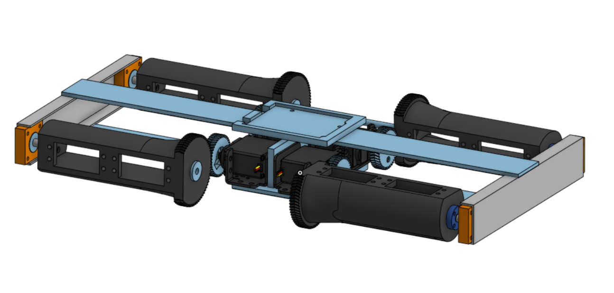

##### Polydog_v3 -- April 2023

---

## CoppeliaSim Quadruped Robot

As on IsaacSim it does not work, I turned to CoppeliaSim that Younes Bazi discovered. The goal will be to create the .ttt file to simulate it on the software.

It's Younes who is on it for the moment, I hope we'll be able to model it quickly on the software and test the angle calculation in reverse kinematics to make it work as we can see on the video.


## 3rd version of the robot3

With the transport probably the two metal servo horns came off. Initially, I had put extra strong glue between the two surfaces to make it stick.


I think I'm going to have a hard time gluing them back together simply because I would have to force the servo horns back into their hinges. I think the next time I have a glue gun handy, I'll glue it back on, hopefully it will be stronger than the last glue.

I really have to do something to secure them. I think that while I'm doing the two months internship, this summer, I'll continue to design the 3rd version of the robot dog to remove all these problems.

I couldn't help but start thinking about it, so to clear my head a bit, I started modeling. Here, I made sure to put a reducer at the shoulders to avoid that the servo forces too much directly and supports 1/4 of the robot, or even 1/2 of the weight when two legs are lifted.



I am thinking about different parameters, like the arrival of the cables and how to make them pass without disturbing the articulation, the optimization of the place for the electronic boards, for the moment I have nothing well defined.

Here is a small function that automates the different positions of the robot, for more ease. I give it the height at which I want it to place its legs and the distance from the center of the hip.

```c++
void PolyDog::stand_up7(double AG, double EG)
{
    double ha, ka;
    get_angle_simplified(AG, EG, ha, ka);
    get_coordonate_E_simplified(ha, ka, AG, EG);
    Serial.println(AG);
    Serial.println(EG);
    for (int i = 0; i < 4; i++)
    {
        leg_list[i].move_hip(ha);
        leg_list[i].move_knee(ka);
    }

    this->hold_shoulders();
}
```

For the different distances, as the size of the feet can change, I wait until I have the squash ball shaped feet that I ordered on Amazon.
