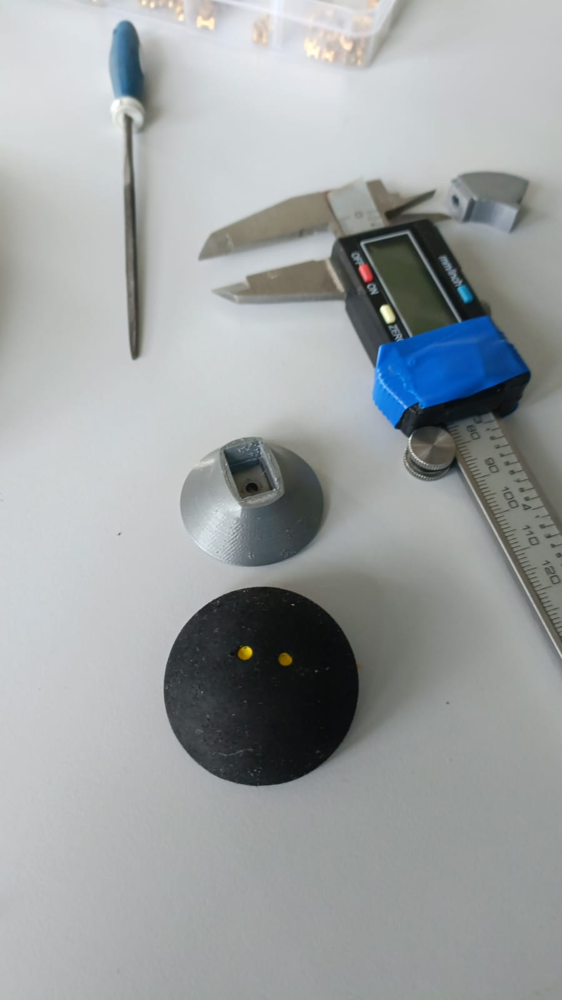
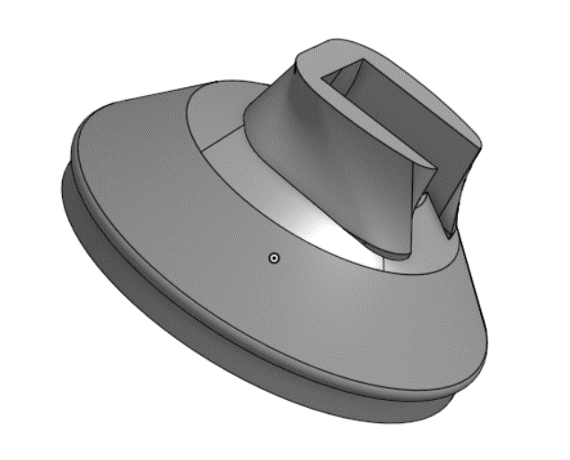
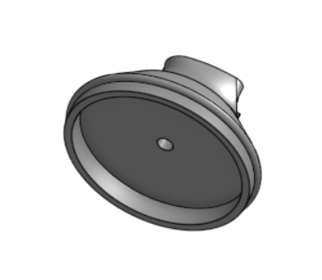
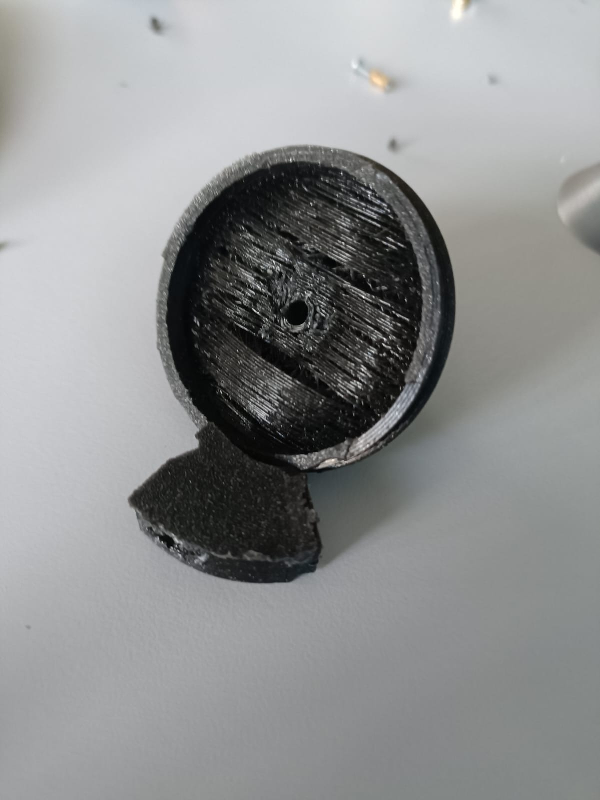
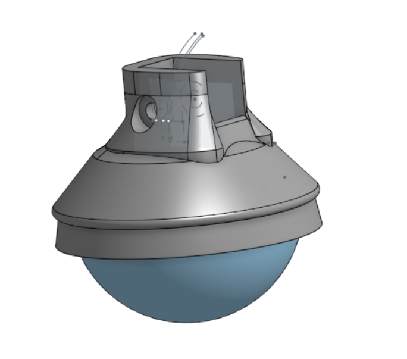

##### Polydog_v3 -- April 2023

---

## Put the shoulder back in place

In the last session, I had some issues with the shoulder which the servo horn came out of their hinges and with the pressure that the servo-motors exert to maintain a certain position, the whole thing came off. I had this problem for two of the legs.

Disassembly and reassembly of the legs with screws to hold the shoulder braces in place. I also added several types of strong glue to make it hold well.

I took the opportunity to put back the housings where the servo motors of the shoulder are located, for more solidity.

## Foot

I received the squash ball by Amazon this last Tuesday. I ordered 2 and cut them in 2, to get 4 feet. I started to model a part that will hang on the tibia of the robot's leg.

I made a first version, but unfortunately, it was the right size, and I didn't make enough space for the 0.4mm print offset.

I took the opportunity to redo the hole larger where the screw will fit, to enlarge the part where the toe part will be fixed on the shin and the part that will be glued to the half squash ball as well.

We can see on the bottom of the toe, I let some space so that the toe can be installed without the help of glue and the squash ball can be replaced very easily. I also lengthened the part that hooks in the tibia to accompany the fixation, and that it is as solid as possible. I'm going to use an insert to make it easier to remove if I ever decide to glue the squash ball to the 3d printed toe cap.

The printing failed, the settings were wrong, it was necessary to select a 0.2 volumic printing profile and a type of filament named PrusaVolPETG. I restarted again. I am waiting for the end of the printing.

After hanging the foot at the end of the tibia that I had printed with my own 3d printer. I realized that putting a screw on the bottom was not enough, so I added a hanging point on the top and it works pretty well.

Now the rest of the feet are printing slowly but surely. My printer, because of the uneven leveling on the plate, prefers to have only one piece at a time for printing.

