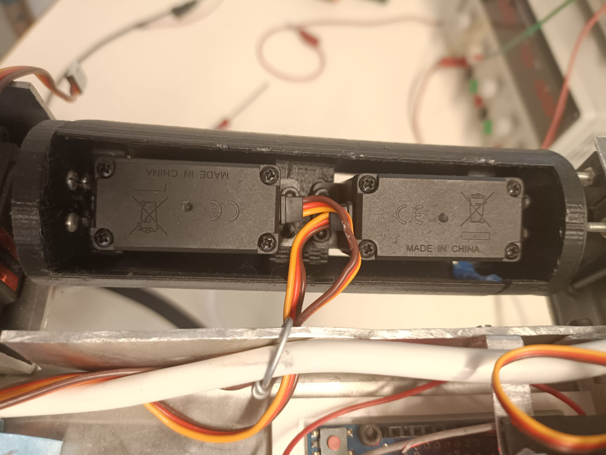
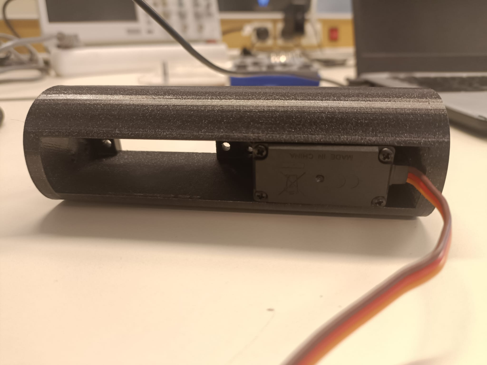
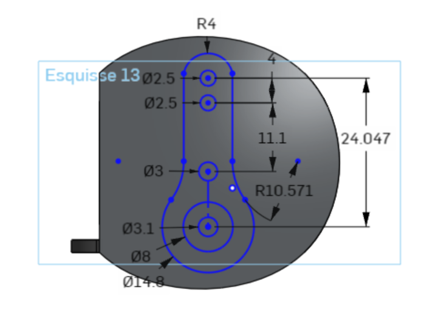
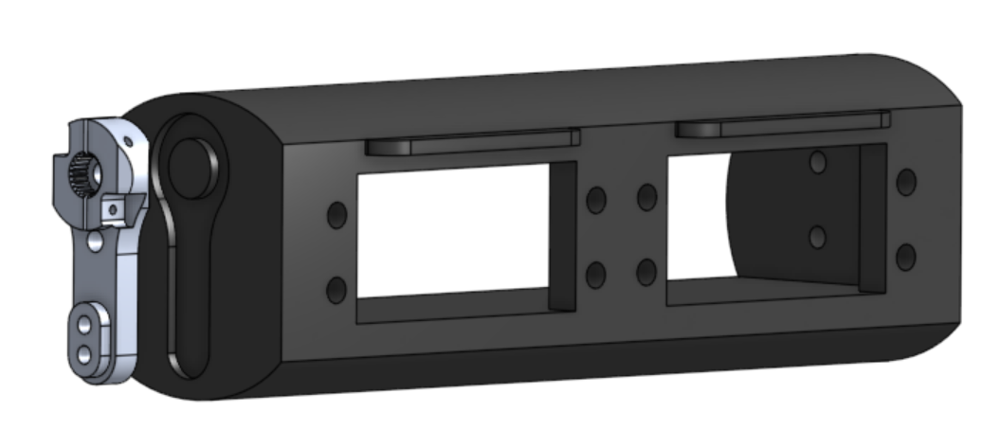
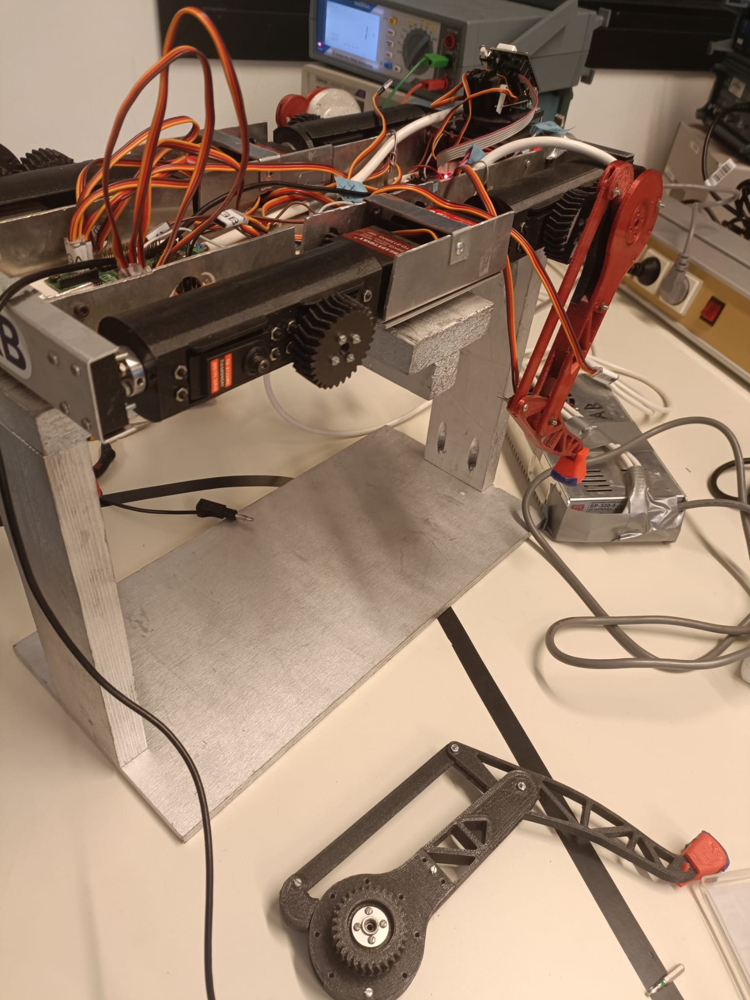
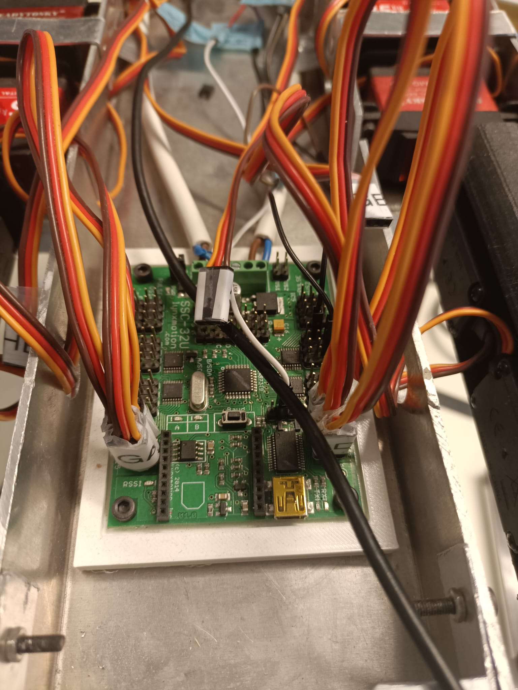
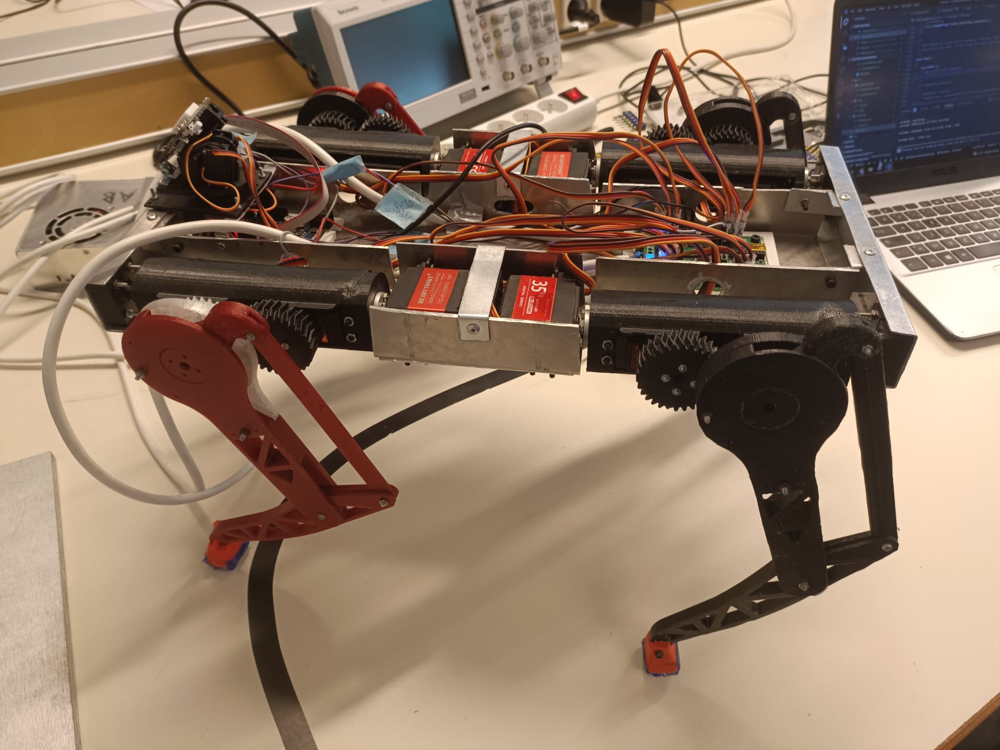

# Session 18/10/2022 - Week 42

##### Polydog_v3 -- October 2022

-----

## Servo housing

Last week I realised that under the effect of the torque, the servo motors move of their place and some screws loosen. So, in order to reduce the angular rotation inaccuracies and consequently the inaccuracies in the movement of the robot legs, I removed the space inside the cases in a new modelisation and print it. I recovered the printed servo casing during the weekend. I inserted a servo inside, it fits perfectly and the weight difference is very low.

|||
|:---:|:---:|
| <b>Figure  2.1 : Current servo housing</b>|<b>Figure  2.2 : New servo housing printed</b>|

I will nevertheless wait before printing the others, because :

I had already noticed it, but I thought about it again during this session. The pitch of the motor shaft gives the other end of the foot an angle deviation of 10 degrees. But in reality there is little play between the servo horn and the servo housings. To remedy this, Nino gave me the idea of embedding the servo horns inside the 3D part to avoid this friction effect.

It would be necessary, however, to find a servo horn in the shape of a cross or star and not a round one, as this would again lead to friction and a loss of angular rotation accuracy, when the shoulder moves from left to right.

TD-8135 MG engines are sold with 
 arm metal horn of 35T. I modelled this by creating an extrusion of the size of these metal horns on a modelling software : 

|||
|:---:|:---:|
| <b>Figure  2.3 : Sketch of the servo horn shape</b>|<b>Figure  2.4 : Metal horn inlay visualisation</b>| 

## Replacement of legs

Putting some nuts back on, I unscrewed and removed the leg from the servo shaft. I unscrewed and put back correctly some of the legs, offset from their counterparts on the other side of the longitudinal axis of the robot (*Figure 2.5*). I also reconnected all the servos on the servo-controller board. This allows me to re-test the old uploaded code so that I can take stock of what's working and what's not.

|<figcaption>Figure2.5 : Disassembly and reassembly of the legs</figcaption>|<figcaption>Figure2.6 : Reconnecting the cables</figcaption>|
|:---:|:---:|

*Link to the video illustrating the current october walk dog robot (starting point of the school year) :* https://www.youtube.com/shorts/fUQeVWmkScw

The result is not very convincing.  There is still a long way to go.

## Servo amperage test

After the end of the session, I wanted to test the amperage that actually flows through the ssc32 servo-controller board in real time, to see if this is related to unwanted movement and torque drop of the robot.

At first, we had trouble measuring an amperage value on the multimeter. Every time we connected the ammeter in series, the servo motor stopped turning as expected. It behaved exactly like a quantum particle when exposed to a camera.

On the video, the knee servo is not moving :

<figure align="center"><figcaption>Figure2.7 : Quantum behaviour of the servo motor</figcaption></figure>

I didn't have the presence of mind to film the moment when we managed to get the ammeter working. But in a typical servo motor movement at the execution of ```dog.move_forward()```, we observed an amperage curve that varies according to the executed movement, sometimes very strongly, when the motor is not solicited. I can clearly imagine this same behaviour accentuated on the ground, since the torque is higher when the paw supports its own weight in addition.

Mr Masson then advised me to add large capacitors to the circuit to smooth out the big drops in amperage and small capacitors for the small variations in current supplied to the motors.

## PlateformIO code

I have added the plateformio ecosystem to the github directory tree. I couldn't figure out how to change the directory of the old ecosystem if it was ever possible, so I created a new one. This has the advantage that I could compare the old and the new.
<table><tr>
<td align="center"> main.cpp  --> </td>
<td align="center"> PolyDog.cpp --> </td>
<td align="center"> Leg.cpp --> </td>
<td align="center"> CustomServo.cpp  --></td>
<td align="center"> Figure2.8_:_Polydog_standing_up  -->  </td>
</tr>
<tr>
<td style=font-size:80% >

 ```cpp
void setup()
{
    dog.start();
    Serial.begin(115200);
}
void loop()
{
    dog.start();   
}
```
</td>
<td style=font-size:80%>

```cpp
void PolyDog::start()
{
    for (int i = 0; i < 4; i++)
    {
        leg_list[i].move_hip(70);
        leg_list[i].move_knee(140);
        delay(100);
    }

    this->hold_shoulders();
}
```
</td>
<td style=font-size:80%>

```cpp
void Leg::move_knee(int angle, int offset)
{
    // _knee_servo.write(abs(_knee_offset - angle));
    _knee_servo.write(abs(offset - angle));
}
```

</td>
<td style=font-size:80%>

```cpp
void CustomServo::write(int angle)
{
  move(map(angle, 0, 180, 500, 2500), 0);
}

void CustomServo::move(int position, int time)
{
  Serial.print("#");
  Serial.print(_pin);
  Serial.print(" P");
  Serial.print(position);
  Serial.print(" T");
  Serial.println(time);
  delay(time);
}
```

</td>
<td></td>
</tr>
</table> 


I think the code tree is optimised, each class building on each other. The things that will have to change are the way you choose the value of the rotation angles. We would like to test with a stabilisation sensor to change the values in the ``` 
move.hip()``` , ``` move.knee()```  and ```move.shoulder()``` function parameters.


