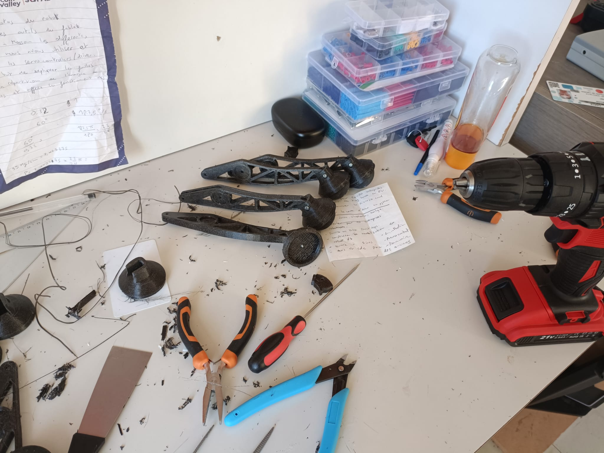
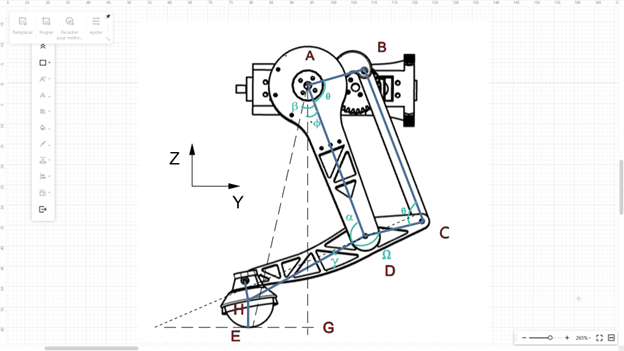
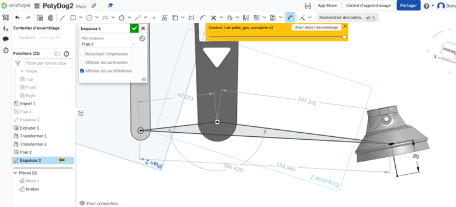

##### Polydog_v3 -- May 2023

---

## Foot and shin printing

After several apttempts, I manage to design, at first sight, a strong attach between the shin and the foot.

Here is the result with the state of the working bench:



## Changing some value for the new configuration

Here, I made the choice to calculate the omega angle by taking the length DH and CH instead of taking it from the tip of the leg as before. It's more precise since the old version, I didn't take into account the point of support which differs according to the orientation of the foot on the ground.


```py
CH = 153.545
CD = 47.273
DH = 107.191
HE = 20
DA = 130
OA = 46.5
omega = math.acos((DH ** 2 + CD ** 2 - CH ** 2) /
                  (2 * CD * DH)) * math.degrees(1)

print(omega)

PS C:\Users\Hugo\Documents\GitHub\Polydog-Robotic_Project_2022-2023> & C:/Users/Hugo/AppData/Local/Programs/Python/Python311/python.exe c:/Users/Hugo/Documents/GitHub/Polydog-Robotic_Project_2022-2023/Code_plateformio/src/maths_v2.py
166.4264827246716
```

The result of the program matches well with what I observe on the diagram, so everything is good for now :



However, I didn't anticipate that the configuration of my angles would be different when the leg is in front, so this will have to be adjusted, later.

The newly printed feet of the robot are attached to the body replacing the old ones, I had to replace some servo motors because they were defective. So, I also had to redo the small adjustments so that the 4 legs are as synchronized as possible. Back on my feet, I launched the code of a step and it's not better. It slides a little on the ground. I think that it comes sincerely from the code. Maybe I'm not putting my paw in the ground enough, to push properly.

However, the rendering with the new feet makes it much more stylish than before, with the Ninjaflex printing.
