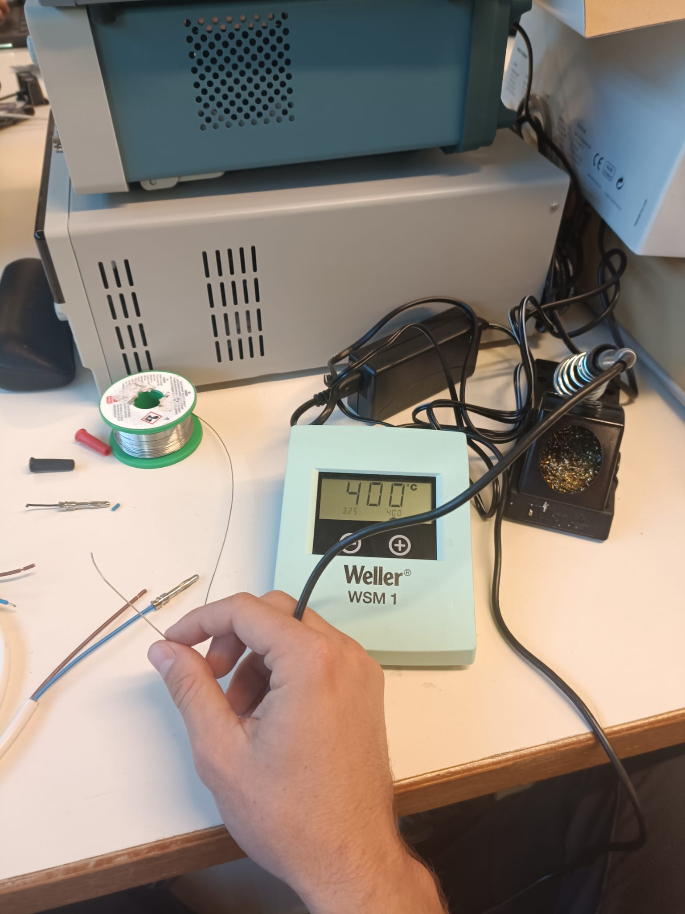
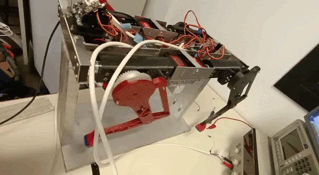
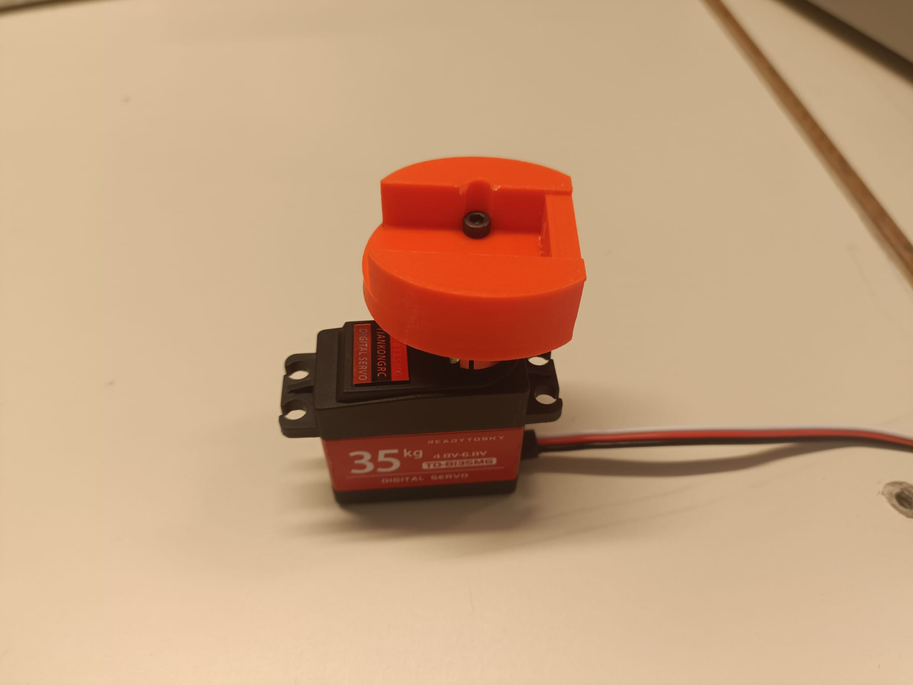

# Session 28/10/2022 - Week 43

##### Polydog_v3 -- October 2022

-----

## Capacitor

The capacitor is a dipole like the resistor, it is also passive because it does not amplify the signal. A capacitor can have several functions in an electronic circuit. For example, it can act as an energy reservoir, much like a battery, it can filter and smooth a voltage for a power supply and thus suppress possible parasites or it can save a state depending on whether it is charged or discharged.

This last particularity is what interests me most. 

I managed to find some female tapers already soldered, in the box, I just had to plug the capacitor in the circuit.

I started by reconnecting the multimeter and redoing the connections. But again I couldn't get the voltage out of the multimeter, probably because of the size of the wires under 0.5mm2 in diameter. I then opted for the oscilloscope, which is actually much more relevant. It allows to observe in real time, the evolution of the voltage.

<figure align="center"><figcaption>Figure3.2 : Oscilloscope voltage drop</figcaption></figure>

I then added capacitors, one on each channel: vs1 and vs2.
The result has not changed, there is still a drop in tension. 
It turns out that even at the input of the SSC32 card there are voltage drops.

So Peter explained to me that the problem could be in the power supply. It could generate voltage, with a lot of current, but sometimes it couldn't keep up with the torque changes. Peter then suggested that I disconnect the + and - cables from the VS1 channels and power them directly from a voltage generator on the classroom benches. He showed me how to solder banana wire ends to a thick wire and hope for better current conductivity.

|||
|:---:|:---:|
| <b>Figure  3.3 : Soldering banana plug </b>|<b>Figure_3.4_:_Result one_side_moving</b>| 

However, this does not change anything again. The same pattern is always repeated.
I left it at that for this session. But I think the cable must have something to do with it. So as soon as I get the chance to work on the robot dog again, I'll measure the voltage at the beginning and end of the cable to test. 

## Servo Housing

I put my old idea into practice to reduce the clearance between the servo motor and the housings. The part fits well. I need to improve the shape of the hole for the propeller bar. There is also a work in the adaptation of the body: 

<figure align="center"><figcaption>Figure3.5 : Motor housing section - Assembly test</figcaption></figure>

Instead of placing the servo horn in the center of the axis, it will be moved downwards. This causes an offset at the other end with the ball bearings. So I have to think carefully about the modelling first before changing. I also have to take into account the factor that the width of the servo horn is changing, and this has to be taken into account, otherwise I may have problems with the final assembly.

