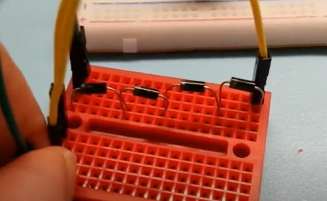

# Session 15/11/2022 - Week 45 & 46

##### Polydog_v3 -- November 2022

-----

## Power supply

I worked on the power supply, to increase the output voltage. I can go up to 5.5V by turning a mechanism inside the power supply.

I did some research about how to increase more the voltage and I found that we can get 6.5 volt by putting diodes in series : https://www.youtube.com/watch?v=lzjDIGSjbfk.

I plan to tackle that next time. I feel like I'm wasting a lot of time on this and that I'm not progressing very quickly. But once I had solved this power problem, I would have already made a leap forward.

## IRreceiver library

I wanted to make the remote control work again so that I could test several functions at the same time without having to recompile the entire code for each change. Especially since I need to unplug the power supply when uploading, then plug it back in when I remove the cable from the computer.

The terminal displays error, no response and then gives random values. I tried to reprogram on Arduino, it gave different errors. After a bit of trouble, I realized that it was because the version of IRREMOTE was too recent for the module. Except that by modifying the version on plateformio it did not change anything. I have to continue to search, to find what's wrong as soon as possible.

## Preparation of the robot body v3

I realized that there was a big problem with the helix-shaped servo horn that I was going to place off-center (shoulder housing, hip and knee gears). Because the axis of rotation is offset from the center of the hip gear, a gap will be created when the helix points to the other gear.

Xavier taught me that it was possible to make my own resin servo horn. The printing would be precise enough to reproduce the pitch of the servo motor tip and strong enough.

However, I can only start printing on Tuesdays. So I have this Sunday to create my piece and prepare it.

