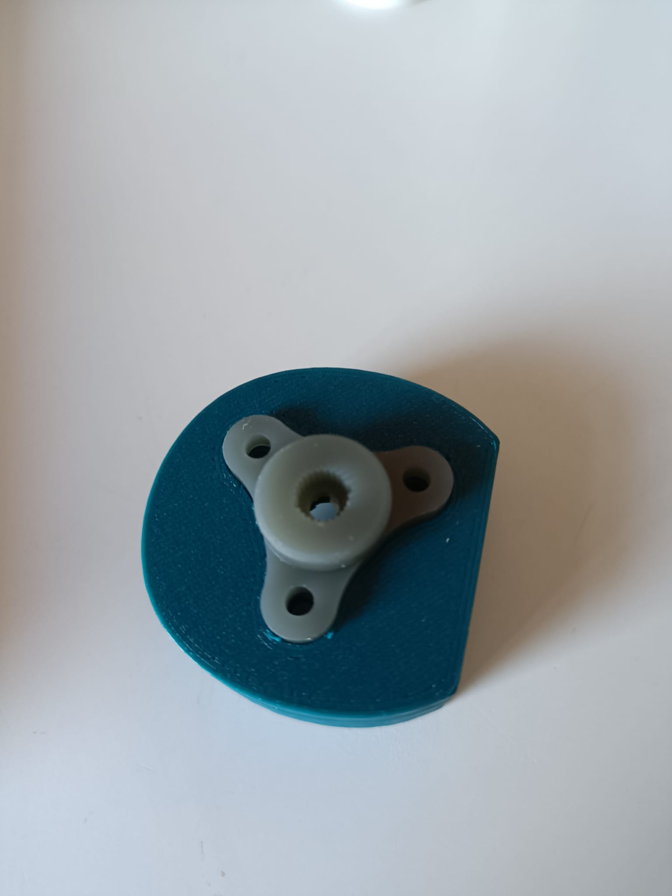

# Session 5 -   25/11/2022 - Week 47 & 48

##### Polydog_v3 -- November 2022

-----

Before starting definitively to program the robot and to make it autonomous which is the first goal of the robotics course, I worked on the new servo horns of the robot to reduce as much as possible the play between the 3D parts and the servo horns.

I modeled it on onshape because it's a software where I built all my 3D parts and I have the possibility to copy the sketches of already existing 3D parts like the pitch of the head of a servo motor, to reproduce it to create another object. 

I adapted the servo motor housing to fit the servo horn inside the part so that there is no play between, like in the following image.

I chose to print it in resin to obtain a great precision of the pitch of a servo horn, and a certain solidity also, by following the advice of Mr Lebreton. After several printing attempts, because the size I had on the software modeling wasn't good, I got my part that fits perfectly on the servo motor head.

I will fix all the nuts by tightening as much as possible and put varnish on the legs so that nothing moves.

I also printed the new housings to accommodate the horn servos and reduced the space between the servos in the housing to prevent them from twisting inside the housing causing a torsion between the two gears of the leg.

