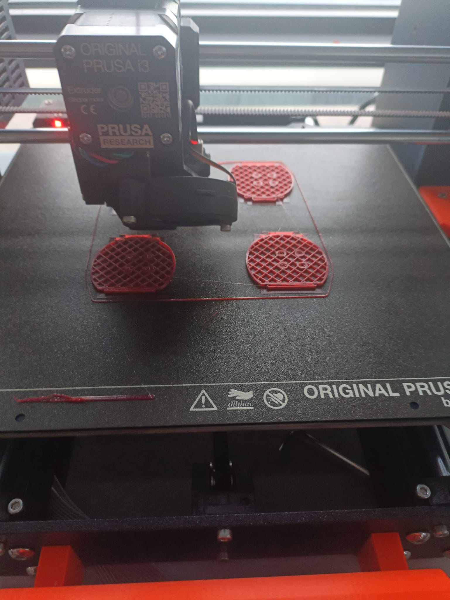
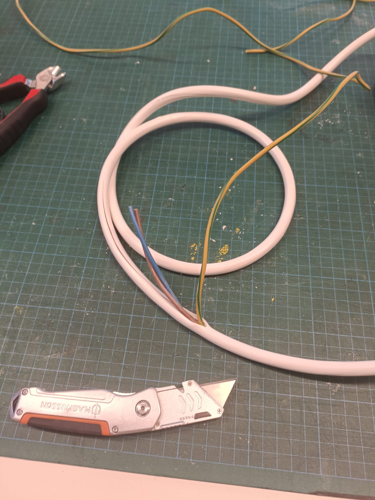

# Session 6 - Week 49

##### Polydog_v3 -- December 2022

-----

## Printing

Negligence on my part, I didn't realize that printing the servo boxes in a different direction would make the print different. Indeed, the horn servos did not fit in their hinges anymore.

So I started them again, making sure to print the mirrored sides of the pieces. I took the opportunity to improve the place to insert the screws, because it's very difficult to unscrew with the servo motors that are hindered by the nuts. The cases are 3mm longer and the holes are chamfered to optimize the space.

I was also able to rearrange the holes for the fixing at the end of the ball bearings, to be able to insert the piece of metal with more ease without having to move the holes to the right place, with a drill, as I had previously done not to restart a printing.

It will took 20 hours of printing so I will have it on Monday.

## Cable stripping 

I received a new cable for the power supply. It has the advantage of having a larger cable section and therefore allow the current to pass more easily hoping to erase the momentary voltage drops from the circuit to the motor.

I cut two sections of cable to feed the two independent channels of the ssc32 card as for the previous cable. I stripped it by removing the sheath which takes weight for not much.

It will be tested once the legs are back in place and the robot is functional again.