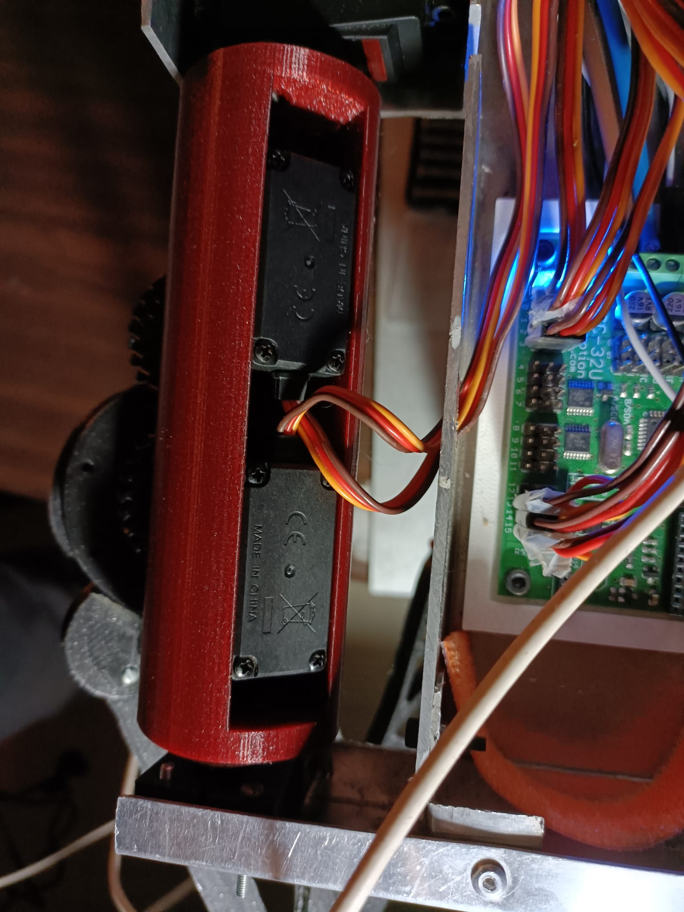
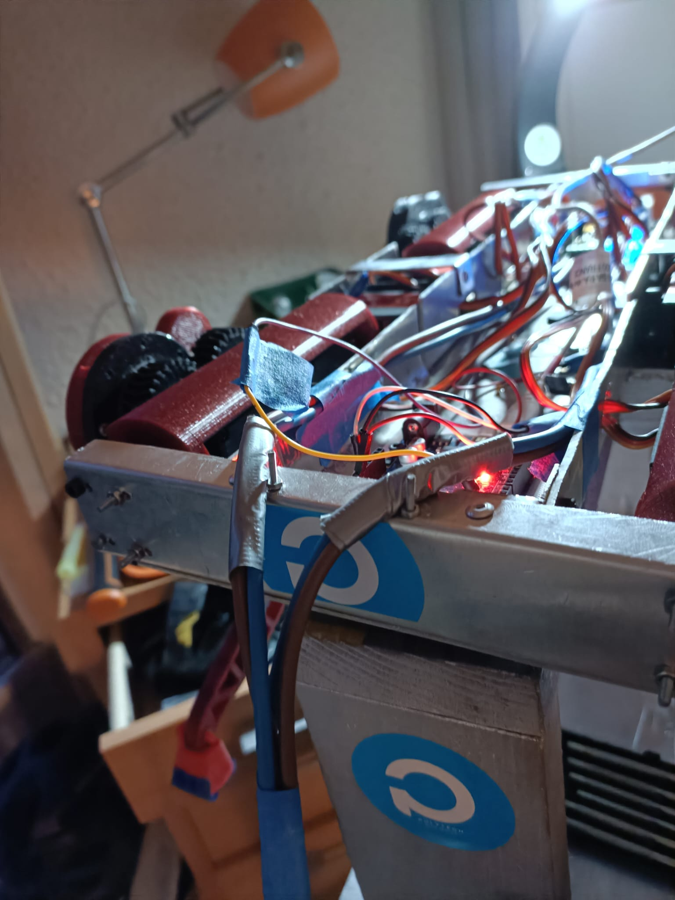

# Session 7 - Week 50

##### Polydog_v3 -- December 2022

-----

# Polydog back again

## Servo motors housings

I would like to do a check up of what I have brought in the last 3 months. In September-October, when I took it back in hand

- The servo motor housings were very fragile. The inside was rounded, which made the thickness too thin and didn't hold the servos in place (some of them unscrewed from their hinges by force, which caused play between the gears on the hip). So I printed new ones that stick to the servos.

- Also, on the old version, screwing the metal rod that holds the housing on the other end was complicated, because the holes for the screws were not in the right places. So I corrected this by taking the time to measure with a caliper the actual distances of the metal part.

- The space for the screw heads also made it very difficult to screw in the servo motors. So I widened the part by 3mm and put a chamfer to have some space.

- Finally, in order to limit the play between the servo and the floor stand, I created my own servo horn in resin print, reproducing the teeth of the servo head. I embedded these horn servos in the case so that nothing moves.

I put the legs back in their place, which takes me a little while for the following reasons:

- I have to connect the shoulder, hip, knee motors to the ssc32 board to get them to 90degree before I screw them in properly. 

- Screw the motors with 4 screws each, which makes 48 screws. 

- Place the legs at the right place so that they are at the same place. I made several tests to make the body of the robot straight, notably by placing green crosses on the table. By modifying the offsets, I am able to add a precision on the position of the legs at the right places

I was a little afraid at the beginning that the servo horns would not hold and be fragile but for the moment I am very satisfied, they keep the shoulders of the robot straight and in the short term, they do the job amply by giving me a minimal play (the servo pitch unchangeable).

It took me a long time to fix this problem, but I think it is clearly worth it. I showed Raph the recent advances and he could see the difference from the old version. He found that the gaps between the parts have been greatly reduced and look more solid. 

## Power supply

By changing the output voltage of the power supply to 5.5V, it gives me a minimum voltage of 5.3V in the voltage drops I had previously. However, I also changed the power supply cable for a larger copper wire section giving me an easier current flow. The result is perfect when I put it on the ground, it does not lose its content and stands upright. He is even a little bit abrupt in his movements, because the motors are powerfull.

