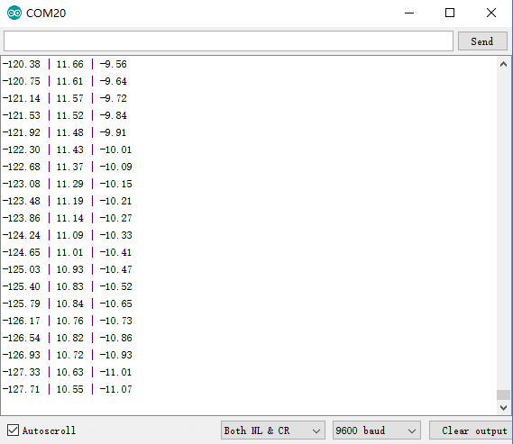

# SESSION OUTCOME REPORT
## Date: 14/10/2022
## Main event of ther report: Learning to use an IMU 

As you know, Balance is a major problem in our project (Polydog), this is why we decided to use an IMU in order to stabilize more the robot.  
 In this session, i learned to use the 10 DOF IMU Sensor. This IMU sensor measures and reports on a craft's velocity, orientation, and gravitational forces, using a combination of accelerometers ,gyroscopes, and magnetometers. For the moment, we are going to use the IMU to reports just on the Polydog orientation, but after we finish our robots, we might use it also to measure the Polydog's velocity.  
  During this session, I Managed to display the euler angles of the sensor using an arduino card. The euler angles are simply just the Yaw, Pitch, and Roll values. The intersting thing about 10 DOF IMU is that the communicatiom interface is i2c.  
   Before using this IMU, you should download first this library: FreeSixIMU. I used this [code](https://wiki.dfrobot.com/10_DOF_Mems_IMU_Sensor_V2.0_SKU__SEN0140) in order to show the euler angles via the serial monitor (figure 1) .  
   But during the execution of the code, I encountered a problem, which is the instability of values: even when the sensor is not moving, the yaw, pitch, and roll values continued to change over time, the fluctuation of values were big, it was about 1 degree per 5 seconds ( which is unacceptable for our project where the major problem is the stabilization ). I kept searching the cause of the problem until Mr.Peter adviced me to go read the reports of a project that used the same IMU (this project was 
autonomous carrier by vincent callegari). Surprisingly, he also had the same problem with this IMU, he indicated that the fluctuation of the values was about 1 degree per minute in the worst case (in my case it  was 1 degree per 5 seconds !! ) and he said that the fluctuation of values wasn't always present.  
Finally, I think we should consider using another IMU if the problem of 10 DOF IMU  was not solved in the future.  

## Figure 1  

