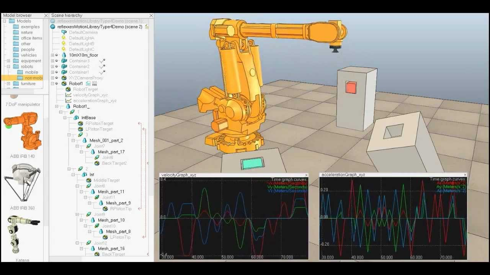

# SESSION 15 OUTCOME REPORT
## Date: 14/03/2023
## Main event of the session: Simulating Robot Dogs with CoppeliaSim V-REP: Exploring Dynamic Properties for Accurate and Stable Simulations  
During the last session, we discussed the progress of our project on coding the Polydog to walk. After analyzing the different methods, we concluded that simulation is the most effective way to code the robot. Simulating the robot will simplify the coding process and help us identify and address any issues before we test it on a physical robot.In light of this, we have decided to shift our focus back to working on simulating the robot. To achieve this, we decided to use a new simulator called Coppelia Sim V-REP.  

CoppeliaSim V-REP is a multi-platform simulation software developed by Coppelia Robotics. The company was founded in 2010 by a group of roboticists and computer scientists based in Switzerland. The software is designed to simulate complex robotic systems and is widely used in research and education.  
The main characteristics of CoppeliaSim V-REP include its user-friendly interface, flexibility, and high-level of customization. The software allows users to create and simulate complex robotic systems, including sensors, actuators, and even entire environments. It also provides a variety of built-in models and tools that users can easily modify and adapt to their specific needs.  
One of the main advantages of CoppeliaSim V-REP is its compatibility with various programming languages, including C++, Python, and Lua. This feature makes it easier for users to integrate their simulation models with real-world robotic systems.  
Compared to other simulators, CoppeliaSim V-REP stands out for its ability to simulate both physical and mechanical systems. It can simulate complex dynamics, including friction, gravity, and collisions. Additionally, the software has an integrated physics engine that can accurately model the behavior of objects in a simulated environment.   

So during this session, I devoted all my time learning this new simulator via youtube. [Leopoldo Armesto](https://www.youtube.com/watch?v=PwGY8PxQOXY&list=PLjzuoBhdtaXOoqkJUqhYQletLLnJP8vjZ&index=1) is a spanish professor that did a serie of videos explaining how to use Coppeliasim V-rep. I learned from his videos that the dynamic properties of an object are very important in order to have a good simulation and a stable behaviour, so we should define them carefully and precisely.  
Dynamic properties are properties that define how an object interacts with the simulated environment. There are two main dynamic properties in CoppeliaSim V-REP: whether an object is dynamic or static, and whether it is respondable or non-respondable.  
A dynamic object is one that can move and be affected by forces such as gravity and collisions with other objects. A static object, on the other hand, is stationary and does not move or respond to forces.  
A respondable object is one that can interact with other objects in the simulation, while a non-respondable object is one that does not interact with other objects. For example, a respondable object may collide with other objects and change its position or orientation, while a non-respondable object would not.  
Understanding the dynamic properties of objects in a simulation is crucial for creating stable and accurate simulations. If an object is incorrectly defined as dynamic or static, or respondable or non-respondable, it can cause unexpected behavior and instability in the simulation.  

Towards the end of the session, I attempted to import the Polydog model from Onshape into CoppeliaSim V-REP. However, I discovered that the joints were not imported with the model for some unknown reasons. As a result, in the next session, I plan to import each part of the robot dog separately into CoppeliaSim V-REP and then assemble them with joints. While this may add some extra time and effort to the simulation process, I am confident that this approach will help ensure that the simulation is accurate and stable.

