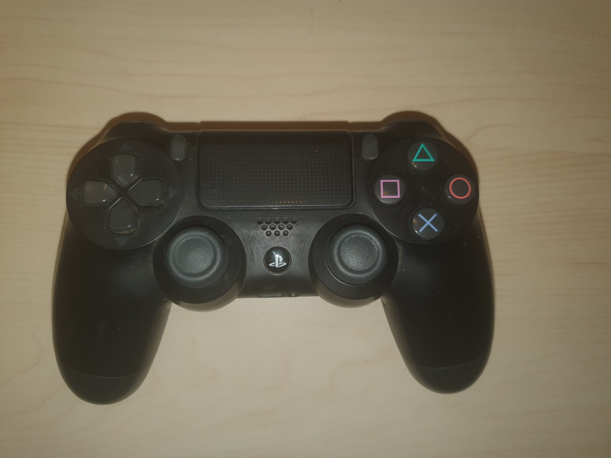
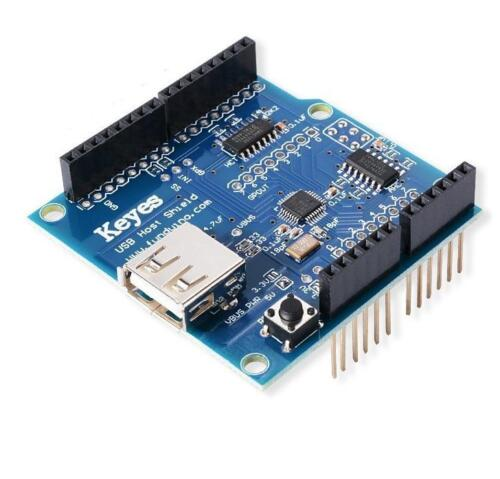
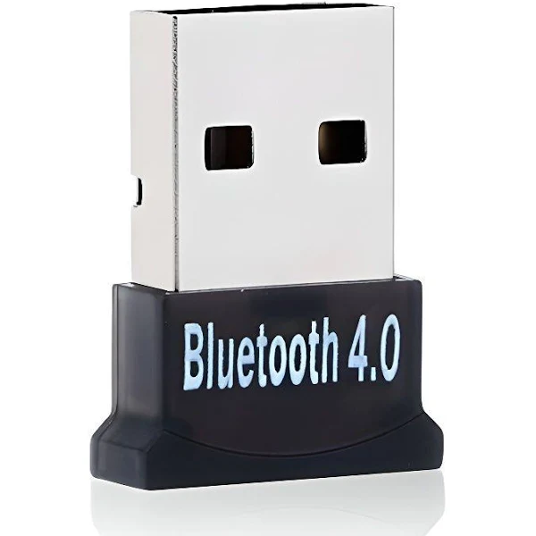
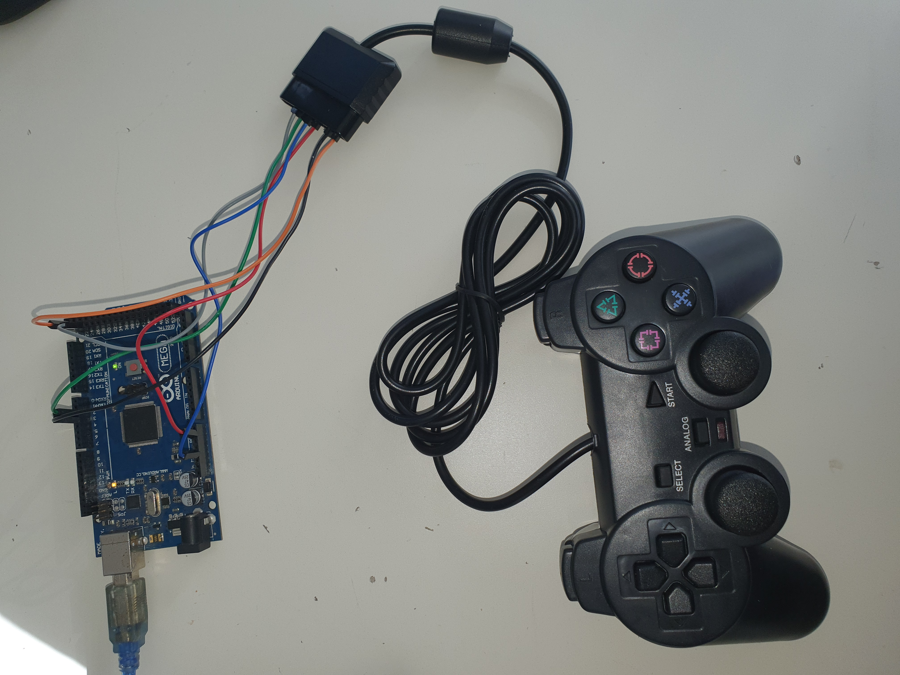
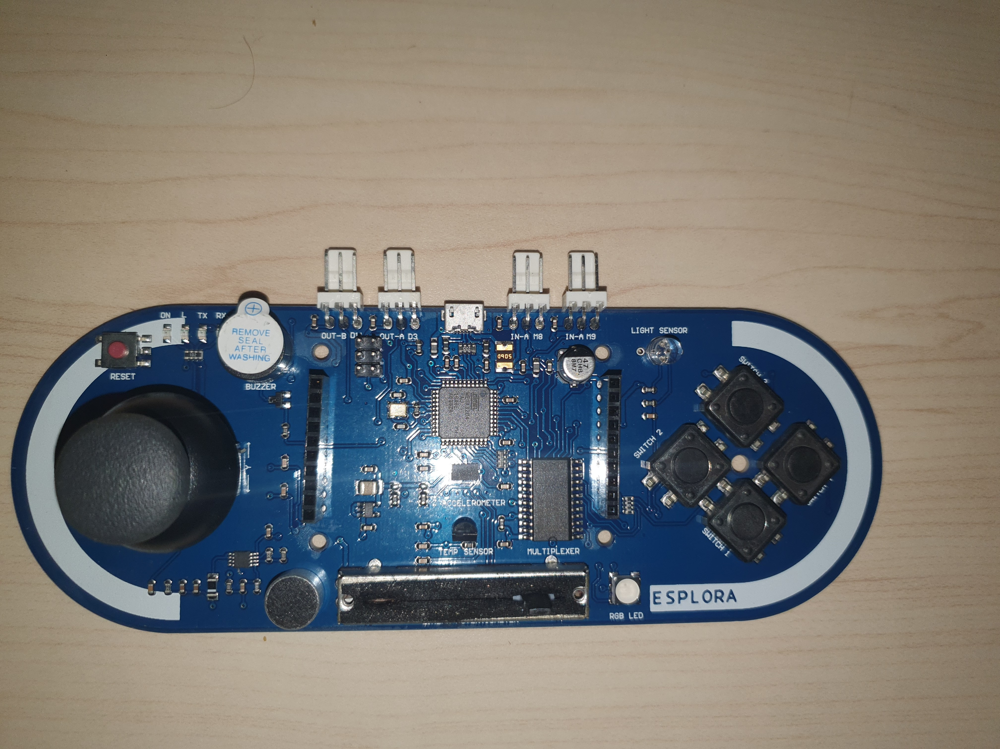

# SESSION 5 OUTCOME REPORT
## Date: 25/11/2022
## Main event of the session: Using a Wireless controller and implementing an Inverse Kinematics code on the Arduino Uno IDE .  
# First Part of the session  
During the first part of this session , we decided to use a remote controller with the Polydog before making it autonomous. At the beginning, we thought that we will use a PS4 controller:  
  
The intersting thing with the PS4 controller is that it has an internal gyroscope, so we are not going only to  control the robot with the 2 joysticks, but also we will be able to control it with the gyro-based motion controls.      
In order to connect the PS4 controller with the arduino uno we need two components:    
1) An USB 2.0 Host Shield that will be put right on the top of the Ardiono Uno and provides support for many USB devices. :  
  
2) An USB Bluetooth dongle (adapter) that after being plugged into the USB 2.0 host shield will transmits and receives Bluetooth wireless signals:  
         

Unfortunately, we couldn't use the PS4 controller because we had only the USB 2.0 host shield and not the USB Bluetooth dongle, so the Professor Pascal Masson decided to give us a wired controller wich is the PS2 controller that it plugs directly into the arduino uno board by following the plan below :  
  
  
And in order to make it works , you only have to download the PS2X_lib library and include it into your arduino IDE.  
At the end, we realised that it will be not practical to use a wired controller, so the Professor Pascal Masson gave us again an Arduino wireless controller called Esplora that also has an internal gyroscope:  
  
# Second Part of the session    
During the second part of the session, i searched for an inverse kinematics code that will be implemented on the arduino IDE, luckily i found someone who already did it for his robot dog , he is a youtuber called James bruton and here is his miniDOG robot [repository](https://github.com/XRobots/miniDog)  
We just have now to adapt the code to our robot by changing just the measurments of the robot, and hopefully it will works when we will test it next week.  
 
