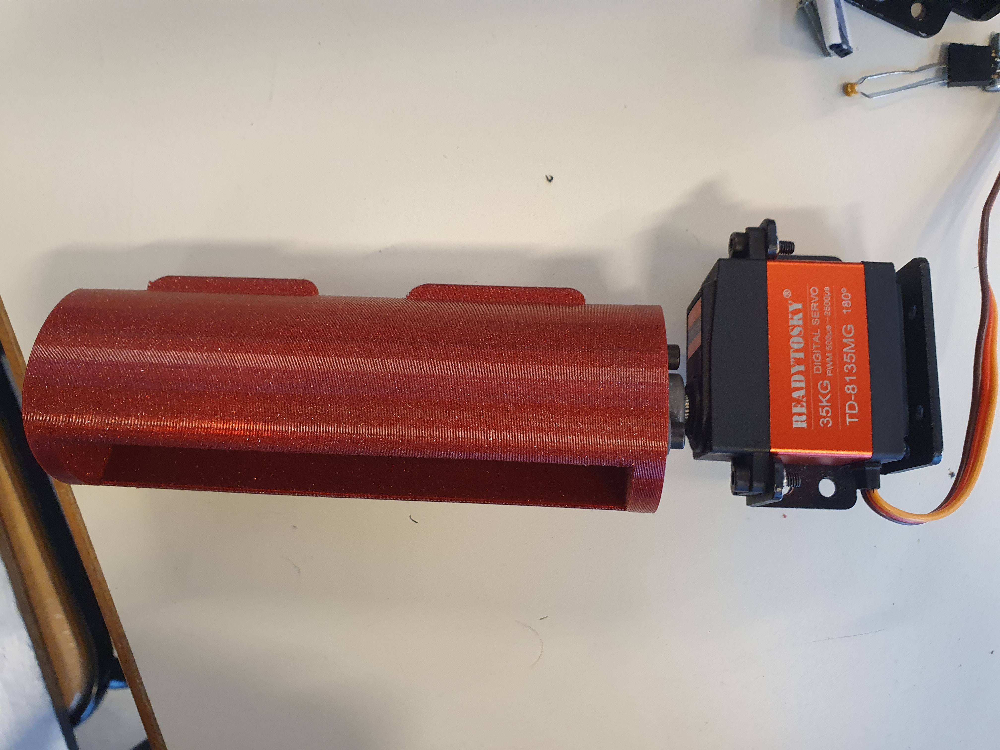

# SESSION 6 OUTCOME REPORT
## Date: 6/12/2022
## Main event of the session: Assembly of the shoulder parts and the servomotors support, the continuation of the Inverse Kinematics code.  
# First Part of the session  
During the first part of the session, I assembled the parts that my colleague have printed, the parts were the new servo horns and the new servomotors supports:  
Figure1 (servo horn):  
 
Figure2 (servomotors support): 
  
It was very difficult to put them together and to screw them together, because, firstly the place where i should put the servo horns in (Figure 2) was very thight, and it was not well sized compared to the servo horns size, so I tried in the first place to assemble them together by force (by hitting), it was not a good idea because it ended up by breaking the servomotors support, After that , i came up with a good idea that my colleague wasn't so happy about it when he found out, i took the soldering iron and then i melted the plastic in order to make room for the servo horn, here is the results :  
  
I know that it's not aesthetic but it does the job.  
I also wasted a lot of time trying to screw the  screws and nuts together, note that i'm not much of a hand worker.  
  
  
 
 # Second Part of the session 
 During the second part of the session, i kept working on the inverse kinematics code, i tried to understand more and adapt the James Bruton [code](https://github.com/XRobots/miniDog/blob/master/miniDog013/Kinematics.ino) but because our robot is completely detached, i can not test the code and furthermore make progression, so i will just wait until the robot is assembled again. In the meantime i will start learning how to use the Esplora controller and how to make it communicates with the arduino mega via bluetooth.   