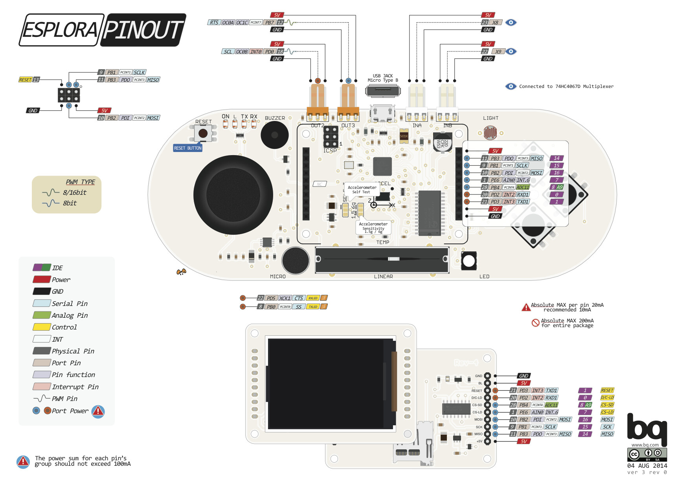

# SESSION 7 OUTCOME REPORT
## Date: 9/12/2022
## Main event of the session: The configuration of the Esplora arduino controller and its communication with the arduino mega via  Bluetooth.  
During this session, i managed to connect the Esplora conntroller to arduino mega via bluetooth, but before initiating the communication via bluetooth, we should program the esplora controler by uploading the code to its microcontroller. The code i uploaded was just a test, I just asked the serial monitor to show me the value 1 if the switch 1 of the esplora controler is not pressed , and the value 0 if the switch 1 is pressed , i used this code:  
`#include <Esplora.h>`  
`void setup()`  
`{`  
 `Serial.begin(38400);`  
 `Serial1.begin(38400);`  
`}`  
`void loop()`  
`{`  
`int a=Esplora.readButton(1);`  
`Serial.println(a);`  
`Serial1.write(a);`  
`}`  
I used this code just to see if i could send this information (0 or 1) to the arduino mega by bluetooth. In order to do that i used the module bluetooth Hc05 (Master) that will be connected to the controller and Hc06 (Slave) that will be connected to the arduino mega.  
Hc05(Master):  
  
  
Hc06(Slave):  
  
  
You can differentiate between the slave and the master by the number of pins, the master has 6, whereas the slave has only 4.  
To wire Hc05 to the Esplora controller we must follow the Esplora Pinout: 
   
   
 Warning: The TXD pin of the Hc05 should be wired to the RXD1 of the controller and the RXD pin should be wired to the TXD1.  
 Like you see in the code above "Serial1.write(a)"  will send the infomation via the TXD1 pin to the Hc05 that will also sends this information to the Hc06 connected to Arduino mega.  
To wire Hc06 to the arduino mega we must follow this plan:  
   
  
  
Warning: The TXD pin of the Hc06 should be wired to the RX3 of the arduino mega and the RXD pin should be wired to the TX3 (and not TX0 and RX0 because this two pins are devoted for the serial communication through the USB connector).  
Before initiating the communication between Hc05 and Hc06 we should upload this code into the arduino mega:  
`#include <Esplora.h>`  
`void setup(){`  
`Serial.begin(38400);`  
`delay(500);`  
`Serial.println("Bonjour -Pret pour les commandes AT");`  
`Serial3.begin(38400);`  
`delay(500);}`  
`void loop(){`  
`while (Serial3.available()) {`  
`Serial.print(Serial3.read()); }`  
`}`  
Warning: The data transmission speed should always be 38400 in both codes.  
Now that the codes are uploaded to the devices and the bluetooth modules are wired to the devices, how can we know that the Hc05 and Hc06 are both connected to each other? If Hc06 stoped blinking and the led builtin stayed on, that means that Hc06 and Hc05 are well connected to each other.  
Even before i press the switch 1 of the controller i can see that the experiment has succeeded because the serial monitor of the arduino mega shows me 1 which means that the switch 1 is not pressed:  
  
when i press Switch 1 and i keep pressing it for a while:  
  
So now the communiation via bluetooth works, we only need now to upload the rest of the code into the microcontroller of the Esplora ie: the code needed to read the Accelerometer,JoystickSwitch, JoystickButton, and the rest of the switchs. We can find all the code needed [here](https://docs.arduino.cc/retired/archived-libraries/EsploraLibrary).