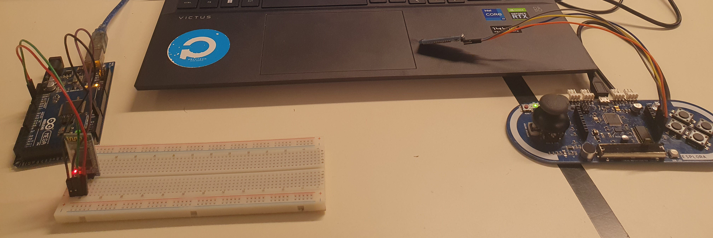

# SESSION 8 OUTCOME REPORT
## Date: 14/12/2022
## Main event of the session: The configuration of the Esplora arduino controller (Part 2)  .  
During session 7, we managed to communicate the Esplora arduino controller with the arduino mega via Bluetooth. So what remains now is just the programming of the Esplora arduino  controller.  
So during session 8 i wrote this code that i uploaded into the controller:  
`#include <Esplora.h>`  
`void setup()`  
`{`  
`Serial.begin(38400);`  
`Serial1.begin(38400);`  
`}`  
`void loop()`  
`{`  
`int a=Esplora.readButton(1);`  
`int b=Esplora.readButton(2);`  
`int c=Esplora.readButton(4);`  
`int d=Esplora.readButton(3);`  
`int e=Esplora.readJoystickButton();`  
`int f=Esplora.readJoystickX();`  
`int g=Esplora.readJoystickY();`  
`int x_axis = Esplora.readAccelerometer(X_AXIS);`  
`int y_axis = Esplora.readAccelerometer(Y_AXIS);`  
`int z_axis = Esplora.readAccelerometer(Z_AXIS);`  
`Serial.print("x= ");`  
`Serial.print(x_axis);`  
`Serial.print("\ty= ");`  
`Serial.print(y_axis);`  
`Serial.print("\tz= ");`  
`Serial.print(z_axis);`  
`Serial.print("\tJoyX= ");`  
`Serial.print(f);`  
`Serial.print("\tJoyY= ");`  
`Serial.print(g);`  
`Serial.print("\tSwitch1= ");`  
`Serial.print(a);`  
`Serial.print("\tSwitch2= ");`  
`Serial.print(b);`  
`Serial.print("\tSwitch3= ");`  
`Serial.print(d);`  
`Serial.print("\tSwitch4= ");`  
`Serial.print(c);`  
`Serial.print("\tJoybutton= ");`  
`Serial.println(e);`  
`delay(100);`  
`Serial1.write("x= ");`  
`Serial1.write(x_axis));`  
`Serial1.write("\n");`  
`Serial1.write("y= ");`  
`Serial1.write(y_axis);`  
`Serial1.write("\n");`  
`Serial1.write("z= ");`  
`Serial1.write(z_axis);`  
`Serial1.write("\n");`  
`Serial1.write("JoyX= ");`  
`Serial1.write(f);`  
`Serial1.write("\n");`  
`Serial1.write("JoyY= ");`  
`Serial1.write(g);`  
`Serial1.write("\n");`  
`Serial1.write("Switch1= ");`  
`Serial1.write(a);`  
`Serial1.write("\n");`  
`Serial1.write("Switch2= ");`  
`Serial1.write(b);`  
`Serial1.write("\n");`  
`Serial1.write("Switch3= ");`  
`Serial1.write(d);`  
`Serial1.write("\n");`  
`Serial1.write("Switch4= ");`  
`Serial1.write(c);`  
`Serial1.write("\n");`  
`Serial1.write("Joybutton= ");`  
`Serial1.write(e);`  
`Serial1.write("\n");`    
`delay(100);`  
`} `  
This code allows to read a button's state and returns if it is pressed or not (0 is pressed and 1 it's not pressed), it also allows to read the position of the X-axis of the joystick. When the joystick is in the center, it returns zero. Positive values indicate the joystick has moved to the right and negative values when moved to the left.(the maximum values are -515 and +512). And of course it also reads the position of the Y-axis of the joystick. When the joystick is in the center, it returns zero. Positive values indicate the joystick has moved up and negative values when moved down.(the maximum values are -515 and +512). On the top of that, this code allows to read the accelerometer too.  
This what the Esplora serial monitor shows:  
  
But when we want to show those informations on the serial monitor of the arduino mega board (after they were sent to arduino mega via bluetooth), we get this:  
  
  
I don't know why it does not show the values, but I suspect it is due to the data type, i tried to change it to every other type but it was in vain. I also have another problem which is how can we take a specific variable from the serial monitor in order to integrat it into our code, for instance the values of the Switches.